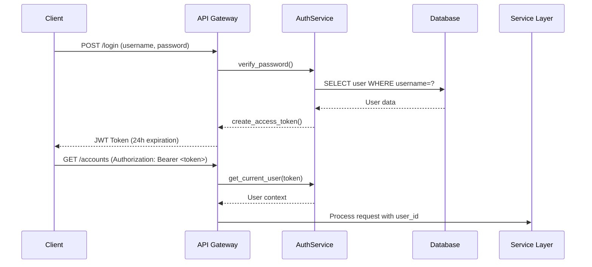
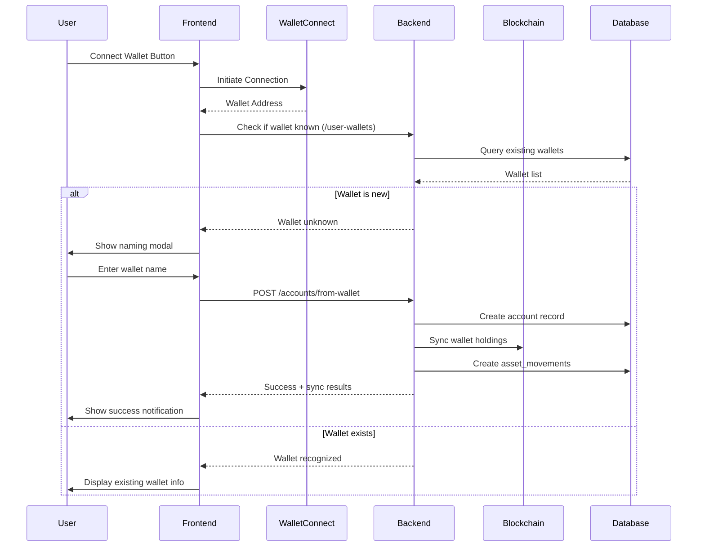

# Comprehensive Technical Documentation v5.0
## Hybrid Financial Portfolio Management System

**Date:** August 27, 2025  
**Version:** v5.0  
**Author:** Senior Full-Stack Software Architect Analysis  
**Project Status:** Production-Ready with Advanced BI Features  

---

## 📂 CLASSES AND COMPONENTS SUMMARY

### 🐍 Backend Classes (Python)

#### Services
- **AccountsReceivableService** (from accounts_receivable_service.py)
- **AccountService** (from account_service.py) 
- **AssetHoldingService** (from asset_holding_service.py)
- **AssetService** (from asset_service.py)
- **BlockchainService** (from blockchain_service.py)
- **DatabaseService** (from database_service.py)
- **EncryptionService** (from encryption_service.py)
- **IconService** (from icon_service.py)
- **ObligationService** (from obligation_service.py)
- **PortfolioService** (from portfolio_service.py)
- **PriceService** (from price_service.py)
- **ReportsService** (from reports_service.py)
- **StrategyService** (from strategy_service.py)
- **SummaryService** (from summary_service.py)
- **TransactionExecutor** (from transaction_executor.py)
- **TransactionService** (from transaction_service.py)
- **WalletSyncService** (from wallet_sync_service.py)

#### Main Application
- **StrategyKeeper** (from keeper.py)
- **ObligationWorker** (from obligation_worker.py)
- **SnapshotWorker** (from snapshot_worker.py)

#### Pydantic Models (from main.py)
- **FinancialObligationCreate**
- **FinancialObligationUpdate**
- **RecurringRuleCreate**
- **RecurringRuleUpdate**
- **SettleObligationRequest**
- **ObligationsSummaryResponse**
- **FinancialObligationResponse**
- **ObligationsListResponse**
- **RecurringRuleResponse**
- **RecurringRulesListResponse**
- **SettlementResponse**
- **AccountsSummaryResponse**
- **AccountStatementResponse**
- **ExpenseAnalysisResponse**
- **MonthlyChashFlowResponse**
- **WalletCreate**
- **UserCreate**
- **StrategyCreate**
- **StrategyUpdate**
- **BacktestCreate**
- **WalletAssociate**
- **VaultCreate**
- **AccountCreate**
- **AccountUpdate**
- **AssetCreate**
- **AssetUpdate**
- **AssetPriceUpdate**
- **AssetHoldingCreate**
- **AssetHoldingUpdate**
- **TransactionCreate**
- **TransactionUpdate**
- **AccountsReceivableCreate**
- **AccountsReceivableUpdate**
- **AssetMovementCreate**
- **AssetMovementUpdate**
- **WalletAccountCreate**

### ⚛️ Frontend Components (React/JSX)

#### Pages
- **AccountDetailsPage** (from AccountDetailsPage.jsx)
- **AccountsPage** (from AccountsPage.jsx)
- **AccountsReceivablePage** (from AccountsReceivablePage.jsx)
- **AssetsPage** (from AssetsPage.jsx)
- **BacktestingPage** (from BacktestingPage.jsx)
- **ChartsPage** (from ChartsPage.jsx)
- **CryptoAccountDetailsPage** (from CryptoAccountDetailsPage.jsx)
- **DashboardPage** (from DashboardPage.jsx)
- **LoginPage** (from LoginPage.jsx)
- **ObligationsPage** (from ObligationsPage.jsx)
- **PortfolioPage** (from PortfolioPage.jsx)
- **ReportsPage** (from ReportsPage.jsx)
- **StrategiesPage** (from StrategiesPage.jsx)
- **TransactionsPage** (from TransactionsPage.jsx)
- **VaultsPage** (from VaultsPage.jsx)
- **WalletsPage** (from WalletsPage.jsx)

#### Components  
- **AdvancedTable** (from AdvancedTable.jsx)
- **AccountIcon** (from AccountIcon.jsx)
- **ProtectedRoute** (from ProtectedRoute.jsx)
- **TokenInput** (from TokenInput.jsx)
- **TokenSelectorModal** (from TokenSelectorModal.jsx)
- **WalletAssociationManager** (from WalletAssociationManager.jsx)

#### Layouts
- **MainLayout** (from MainLayout.jsx)

#### Main App
- **App** (from App.jsx)

#### Hooks/Utils (JavaScript Functions)
- **useSorting** (from useSorting.js)
- **setAuthToken, getAuthToken, removeAuthToken** (from auth.js)
- **handleApiError, handleApiSuccess, withErrorHandling, withErrorHandlingSilent, checkAuthResponse, apiCircuitBreaker** (from errorHandler.js)
- **POLYGON_TOKENS, findTokenByAddress, getTokensByCategory, TOKEN_CATEGORIES** (from tokenConstants.js)

### 📊 Summary Statistics
- **Backend Classes**: 50 total (19 Services, 3 Workers/Core, 27 Pydantic Models, 3 Test Classes)
- **Frontend Components**: 25 total (16 Pages, 6 Components, 1 Layout, 1 Main App, 1 Hook + utility functions)
- **Total System Classes/Components**: 75

---

## 📋 Executive Summary

This system represents a cutting-edge **Hybrid Financial Portfolio Management Platform** that seamlessly integrates traditional financial management (TradFi) with decentralized finance (DeFi) capabilities. Built as a full-stack solution using modern technologies, it provides users with comprehensive tools for managing their entire financial ecosystem from a single, unified interface.

### Core Value Proposition
- **Unified Asset Management**: Manage traditional bank accounts, credit cards, crypto wallets, stocks, bonds, and real estate investments in one platform
- **Real-Time Blockchain Integration**: Native Web3 support with automatic token discovery and portfolio synchronization
- **Advanced Analytics**: Business Intelligence features with historical snapshots, cash flow analysis, and performance tracking
- **Automated Trading**: Strategy management with smart contract execution capabilities
- **Complete Audit Trail**: Every financial transaction and asset movement is tracked with full accountability

---

## 🏗️ System Architecture Overview

### Architectural Pattern: Modern Full-Stack with Web3 Integration

```
┌─────────────────────────────────────────────────────────────────┐
│                      CLIENT LAYER                               │
│  React 19.1.1 + Mantine UI 8.2.5 + Web3 (Wagmi/Viem)         │
└─────────────────────┬───────────────────────────────────────────┘
                      │ HTTP/REST API + WebSocket
┌─────────────────────▼───────────────────────────────────────────┐
│                   API GATEWAY                                   │
│  FastAPI 0.116.1 + JWT Authentication + CORS Middleware        │
└─────────────────────┬───────────────────────────────────────────┘
                      │ Service Orchestration
┌─────────────────────▼───────────────────────────────────────────┐
│                 SERVICE LAYER                                   │
│  14 Specialized Services + Business Logic + External APIs      │
└─────────────────────┬───────────────────────────────────────────┘
                      │ Database Abstraction
┌─────────────────────▼───────────────────────────────────────────┐
│                  DATA LAYER                                     │
│  MySQL 8.0.30 + 15 Tables + Views + Stored Procedures         │
└─────────────────────────────────────────────────────────────────┘

              ┌─────────────────────────────────────────┐
              │         EXTERNAL INTEGRATIONS           │
              │  • CoinGecko API (Crypto Prices)       │
              │  • Alpha Vantage API (Stock Prices)    │  
              │  • Polygon/Alchemy RPC (Blockchain)    │
              │  • PolygonScan API (Transaction Data)  │
              └─────────────────────────────────────────┘
```

---

## 💻 Technology Stack Analysis

### Backend Technologies
| Component | Technology | Version | Purpose |
|-----------|------------|---------|---------|
| **Framework** | FastAPI | 0.116.1 | High-performance async API framework |
| **Database** | MySQL | 8.0.30 | Primary data persistence |
| **ORM Strategy** | Raw SQL | N/A | Direct SQL for performance and control |
| **Authentication** | JWT + BCrypt | Latest | Secure token-based auth |
| **Web3 Integration** | Web3.py | 7.13.0 | Ethereum/Polygon blockchain interaction |
| **HTTP Client** | HTTPx | 0.28.1 | Async external API requests |
| **Encryption** | Cryptography | 45.0.6 | Data encryption and key management |

### Frontend Technologies  
| Component | Technology | Version | Purpose |
|-----------|------------|---------|---------|
| **Framework** | React | 19.1.1 | Modern UI framework |
| **Build Tool** | Vite | 7.1.2 | Ultra-fast development and build |
| **UI Library** | Mantine UI | 8.2.5 | Complete component ecosystem |
| **Web3 Integration** | Wagmi + Viem | 2.16.4 + 2.34.0 | Ethereum wallet connectivity |
| **State Management** | TanStack Query | 5.85.5 | Server state management |
| **Charts** | Recharts | 3.1.2 | Data visualization |
| **Routing** | React Router | 7.8.1 | Client-side routing |

### Key Dependencies & Integrations
- **python-jose**: JWT token handling
- **passlib + bcrypt**: Password hashing and security
- **mysql-connector-python**: Database connectivity
- **eth-account, eth-keys**: Ethereum cryptographic operations
- **requests**: Synchronous HTTP requests for external APIs

---

## 🗄️ Database Schema & Data Models

### Core Entity Relationship Model

```sql
-- Primary Entities --
users (1) ──── (N) accounts
users (1) ──── (N) transactions  
users (1) ──── (N) asset_movements
users (1) ──── (N) financial_obligations
users (1) ──── (N) strategies
users (1) ──── (N) daily_financial_snapshots

-- Secondary Relationships --
accounts (1) ──── (N) asset_movements
assets (1) ──── (N) asset_movements
transactions (0..1) ──── (0..1) financial_obligations
recurring_rules (1) ──── (N) financial_obligations
institutions (1) ──── (N) accounts
```

### Database Tables Breakdown

#### 1. **users** - User Management & Authentication
```sql
CREATE TABLE users (
    id INT PRIMARY KEY AUTO_INCREMENT,
    user_name VARCHAR(100) NOT NULL,
    password_hash VARCHAR(255) NOT NULL,  -- BCrypt hashed
    email VARCHAR(255),
    user_level INT DEFAULT 0,  -- Access control levels
    google_id VARCHAR(255),    -- OAuth integration
    avatar_url VARCHAR(512),
    created_at TIMESTAMP DEFAULT CURRENT_TIMESTAMP,
    last_login TIMESTAMP,
    last_logout TIMESTAMP
);
```

#### 2. **accounts** - Multi-Asset Account Management
```sql
CREATE TABLE accounts (
    id INT PRIMARY KEY AUTO_INCREMENT,
    user_id INT NOT NULL,
    institution_id INT,
    name VARCHAR(255) NOT NULL,
    type ENUM('CONTA_CORRENTE','POUPANCA','CORRETORA_NACIONAL',
              'CORRETORA_CRIPTO','CARTEIRA_CRIPTO','CARTAO_CREDITO','DINHEIRO_VIVO'),
    institution VARCHAR(255),
    credit_limit DECIMAL(20,2) DEFAULT 0.00,
    invoice_due_day INT,
    public_address VARCHAR(255),  -- Blockchain wallet address
    balance DECIMAL(20,2),
    icon_url VARCHAR(500),
    FOREIGN KEY (user_id) REFERENCES users(id) ON DELETE CASCADE,
    FOREIGN KEY (institution_id) REFERENCES institutions(id)
);
```

#### 3. **assets** - Universal Asset Registry
```sql
CREATE TABLE assets (
    id INT PRIMARY KEY AUTO_INCREMENT,
    symbol VARCHAR(50) UNIQUE NOT NULL,
    name VARCHAR(255) NOT NULL,
    asset_class ENUM('CRIPTO','ACAO_BR','ACAO_US','PREVIDENCIA','FUNDO',
                     'FII','COE','RENDA_FIXA','TESOURO','COMMODITIES','OUTROS'),
    price_api_identifier VARCHAR(255),  -- CoinGecko/Alpha Vantage ID
    contract_address VARCHAR(255),      -- ERC-20 contract address
    decimals INT DEFAULT 18,            -- Token precision
    last_price_usdt DECIMAL(36,18),
    last_price_brl DECIMAL(36,18),
    last_price_updated_at DATETIME,
    icon_url VARCHAR(500),
    
    -- Alpha Vantage Stock Data --
    av_open DECIMAL(20,8),
    av_high DECIMAL(20,8),
    av_low DECIMAL(20,8),
    av_volume BIGINT,
    av_latest_trading_day DATE,
    av_previous_close DECIMAL(20,8),
    av_change DECIMAL(20,8),
    av_change_percent DECIMAL(20,8)
);
```

#### 4. **asset_movements** - Portfolio Transaction Ledger
```sql
CREATE TABLE asset_movements (
    id INT PRIMARY KEY AUTO_INCREMENT,
    user_id INT NOT NULL,
    account_id INT NOT NULL,
    asset_id INT NOT NULL,
    movement_type ENUM('COMPRA','VENDA','TRANSFERENCIA_ENTRADA',
                       'TRANSFERENCIA_SAIDA','SINCRONIZACAO'),
    movement_date DATETIME NOT NULL,
    quantity DECIMAL(36,18) NOT NULL,
    price_per_unit DECIMAL(36,18),
    fee DECIMAL(36,18) DEFAULT 0,
    notes TEXT,
    
    -- Blockchain Transaction Data --
    tx_hash VARCHAR(255) UNIQUE,
    from_address VARCHAR(255),
    to_address VARCHAR(255),
    block_number BIGINT,
    gas_fee DECIMAL(36,18),
    
    FOREIGN KEY (user_id) REFERENCES users(id) ON DELETE CASCADE,
    FOREIGN KEY (account_id) REFERENCES accounts(id) ON DELETE CASCADE,
    FOREIGN KEY (asset_id) REFERENCES assets(id) ON DELETE CASCADE
);
```

#### 5. **transactions** - Financial Transaction Ledger
```sql
CREATE TABLE transactions (
    id INT PRIMARY KEY AUTO_INCREMENT,
    user_id INT NOT NULL,
    description VARCHAR(255) NOT NULL,
    amount DECIMAL(20,2) NOT NULL,
    transaction_date DATE NOT NULL,
    type ENUM('RECEITA','DESPESA','TRANSFERENCIA'),
    category VARCHAR(100),
    from_account_id INT,  -- Source account for transfers/expenses
    to_account_id INT,    -- Destination account for transfers/income
    status ENUM('EFETIVADO','PENDENTE'),
    created_at TIMESTAMP DEFAULT CURRENT_TIMESTAMP,
    
    FOREIGN KEY (user_id) REFERENCES users(id) ON DELETE CASCADE,
    FOREIGN KEY (from_account_id) REFERENCES accounts(id) ON DELETE SET NULL,
    FOREIGN KEY (to_account_id) REFERENCES accounts(id) ON DELETE SET NULL
);
```

#### 6. **daily_financial_snapshots** - Advanced BI & Analytics
```sql
CREATE TABLE daily_financial_snapshots (
    id BIGINT PRIMARY KEY AUTO_INCREMENT,
    user_id INT NOT NULL,
    snapshot_date DATE NOT NULL,
    
    -- Core Financial Metrics --
    total_net_worth_brl DECIMAL(20,2) NOT NULL,
    total_assets_brl DECIMAL(20,2) NOT NULL,
    total_liabilities_brl DECIMAL(20,2) NOT NULL,
    liquid_assets_brl DECIMAL(20,2) NOT NULL,
    invested_assets_brl DECIMAL(20,2) NOT NULL,
    
    -- Asset Class Breakdown --
    crypto_portfolio_value_brl DECIMAL(20,2) DEFAULT 0.00,
    stock_portfolio_value_brl DECIMAL(20,2) DEFAULT 0.00,
    fixed_income_value_brl DECIMAL(20,2) DEFAULT 0.00,
    real_estate_funds_value_brl DECIMAL(20,2) DEFAULT 0.00,
    other_investments_value_brl DECIMAL(20,2) DEFAULT 0.00,
    
    -- Cash Flow Metrics (Rolling 30 days) --
    income_last_30_days_brl DECIMAL(20,2) DEFAULT 0.00,
    expenses_last_30_days_brl DECIMAL(20,2) DEFAULT 0.00,
    investments_last_30_days_brl DECIMAL(20,2) DEFAULT 0.00,
    disinvestments_last_30_days_brl DECIMAL(20,2) DEFAULT 0.00,
    
    -- Flexible JSON Data --
    asset_class_distribution_json JSON,
    expense_category_distribution_json JSON,
    
    UNIQUE KEY uq_user_snapshot_date (user_id, snapshot_date),
    FOREIGN KEY (user_id) REFERENCES users(id) ON DELETE CASCADE
);
```

#### 7. **financial_obligations** - Accounts Payable/Receivable
```sql
CREATE TABLE financial_obligations (
    id INT PRIMARY KEY AUTO_INCREMENT,
    user_id INT NOT NULL,
    description VARCHAR(255) NOT NULL,
    amount DECIMAL(20,2) NOT NULL,
    due_date DATE NOT NULL,
    type ENUM('PAYABLE','RECEIVABLE'),
    status ENUM('PENDING','PAID','OVERDUE') DEFAULT 'PENDING',
    category VARCHAR(100),
    entity_name VARCHAR(255),
    notes TEXT,
    linked_transaction_id INT,  -- Links to actual payment transaction
    recurring_rule_id INT,      -- Links to recurring automation
    
    FOREIGN KEY (user_id) REFERENCES users(id) ON DELETE CASCADE,
    FOREIGN KEY (linked_transaction_id) REFERENCES transactions(id) ON DELETE SET NULL,
    FOREIGN KEY (recurring_rule_id) REFERENCES recurring_rules(id)
);
```

### Business Views & Computed Data

#### **vw_portfolio_summary** - Real-time Portfolio View
```sql
CREATE VIEW vw_portfolio_summary AS
SELECT 
    am.user_id,
    am.account_id,
    am.asset_id,
    a.symbol,
    a.name AS asset_name,
    a.asset_class,
    a.price_api_identifier,
    a.last_price_usdt,
    a.last_price_brl,
    a.last_price_updated_at,
    
    -- Portfolio Position Calculations --
    SUM(CASE WHEN am.movement_type IN ('COMPRA','TRANSFERENCIA_ENTRADA','SINCRONIZACAO') 
             THEN am.quantity ELSE 0 END) AS total_bought,
    SUM(CASE WHEN am.movement_type IN ('VENDA','TRANSFERENCIA_SAIDA') 
             THEN am.quantity ELSE 0 END) AS total_sold,
    SUM(CASE WHEN am.movement_type IN ('COMPRA','TRANSFERENCIA_ENTRADA','SINCRONIZACAO') 
             AND am.price_per_unit IS NOT NULL
             THEN (am.quantity * am.price_per_unit) ELSE 0 END) AS total_invested,
    SUM(CASE WHEN am.movement_type IN ('COMPRA','TRANSFERENCIA_ENTRADA','SINCRONIZACAO') 
             AND am.price_per_unit IS NOT NULL
             THEN am.quantity ELSE 0 END) AS weighted_quantity,
    MAX(am.movement_date) AS acquisition_date
    
FROM asset_movements am
JOIN assets a ON am.asset_id = a.id
GROUP BY am.asset_id, am.user_id, am.account_id
HAVING (total_bought - total_sold) > 0;  -- Only show positions with balance
```

---

## 🔧 Backend Service Architecture

### Service Layer Pattern Implementation

The backend follows a **Service Layer Pattern** with 14 specialized services, each implementing the Single Responsibility Principle:

#### Core Services

##### 1. **AuthService** - Security & Authentication
```python
class AuthService:
    """Handles JWT authentication, password hashing, and user sessions"""
    
    def create_access_token(data: dict) -> str:
        """Creates JWT token with 24-hour expiration"""
        
    def verify_password(plain_password: str, hashed_password: str) -> bool:
        """BCrypt password verification"""
        
    def get_current_user(token: str) -> dict:
        """JWT token validation and user extraction"""
```

**Key Features:**
- JWT tokens with 24-hour expiration
- BCrypt password hashing with salt rounds
- OAuth2 Bearer token scheme
- Automatic token validation on protected routes

##### 2. **DatabaseService** - Data Access Layer
```python
class DatabaseService:
    """Central database connection and utility service"""
    
    def get_connection():
        """Singleton MySQL connection with connection pooling"""
        
    def execute_query(query: str, params: tuple):
        """Parameterized query execution with error handling"""
        
    def get_user_by_username(username: str):
        """User authentication lookup"""
```

**Key Features:**
- MySQL connection singleton pattern
- Parameterized queries for SQL injection protection
- Transaction management with commit/rollback
- Connection pooling for performance

##### 3. **PriceService** - Market Data Integration
```python
class PriceService:
    """Async external API integration for asset pricing"""
    
    async def get_crypto_prices_in_usd(api_ids: List[str]) -> Dict[str, float]:
        """Batch cryptocurrency pricing from CoinGecko"""
        
    async def get_usd_to_brl_rate() -> float:
        """Real-time USD/BRL exchange rate"""
        
    def update_stock_price(asset_id: int) -> dict:
        """Alpha Vantage integration for stock prices"""
```

**Key Features:**
- Async HTTP client with connection management
- Batch pricing requests for optimization
- Rate limiting compliance (15s between Alpha Vantage calls)
- Decimal precision for financial calculations
- Error handling with retry logic

##### 4. **WalletSyncService** - Blockchain Integration Pipeline
```python
class WalletSyncService:
    """Advanced Web3 integration with auto-discovery"""
    
    async def sync_wallet_holdings(user_id: int, account_id: int, address: str):
        """Complete wallet synchronization pipeline"""
        # 1. Pre-load known crypto assets from database
        # 2. Batch price fetching from CoinGecko
        # 3. On-chain token discovery via Web3
        # 4. Balance calculations with proper decimals
        # 5. Database updates with transaction safety
        
    def _get_token_balance(address: str, contract: str) -> int:
        """ERC-20 token balance queries"""
        
    def _create_asset_from_contract(contract_address: str):
        """Auto-discovery and asset creation for new tokens"""
```

**Key Features:**
- Auto-discovery of new ERC-20 tokens
- Batch processing for performance optimization
- Decimal precision calculations (up to 50 digits)
- Atomic database updates with rollback safety
- ERC-20 standard integration (name, symbol, decimals)

##### 5. **ReportsService** - Business Intelligence Engine
```python
class ReportsService:
    """Advanced analytics and financial reporting"""
    
    def generate_daily_snapshot(user_id: int, snapshot_date: date) -> dict:
        """Comprehensive financial snapshot generation"""
        
    def get_historical_allocation(user_id: int, start_date: date, end_date: date):
        """Asset allocation analysis over time"""
        
    def get_cash_flow_kpis(user_id: int, start_date: date, end_date: date):
        """Cash flow analysis with period filtering"""
        
    def get_top_expenses(user_id: int, start_date: date, end_date: date):
        """Expense analysis and categorization"""
```

**Key Features:**
- Daily snapshot automation with UPSERT patterns
- Historical data analysis with time series support
- JSON storage for flexible nested data
- KPI calculation engines
- Drill-down capabilities for detailed analysis

##### 6. **SummaryService** - Dashboard Analytics
```python
class SummaryService:
    """Real-time dashboard data aggregation"""
    
    def get_dashboard_summary(user_id: int) -> dict:
        """Complete dashboard KPI calculation"""
        
    def get_cash_flow_chart_data_by_period(period: str) -> List[dict]:
        """Time-series cash flow visualization data"""
        
    def _calculate_crypto_wallet_balance(account_id: int) -> float:
        """Real-time crypto portfolio valuation"""
```

**Key Features:**
- Real-time KPI calculations
- Multi-currency portfolio valuation
- Asset allocation computation
- Cash flow trend analysis
- Account balance reconciliation

### Service Integration Patterns

#### Dependency Injection Pattern
```python
# main.py - Service instantiation
database_service = DatabaseService()
price_service = PriceService(database_service)
wallet_sync_service = WalletSyncService(price_service, database_service)
summary_service = SummaryService(database_service, price_service)
```

#### Async Context Manager Pattern
```python
# External API resource management
async with price_service as ps:
    crypto_prices = await ps.get_crypto_prices_in_usd(api_ids)
    usd_brl_rate = await ps.get_usd_to_brl_rate()
```

---

## 🎨 Frontend Architecture & Components

### React Application Structure

```
src/
├── components/           # Reusable UI components
│   ├── AccountIcon.jsx      # Typified account iconography
│   ├── AdvancedTable.jsx    # Data table with sorting/filtering
│   ├── ProtectedRoute.jsx   # Authentication guard
│   ├── TokenInput.jsx       # Web3 token input component
│   ├── TokenSelectorModal.jsx  # Token selection interface
│   └── WalletAssociationManager.jsx  # Web3 onboarding
├── hooks/                # Custom React hooks
│   └── useSorting.js        # Table sorting functionality
├── layouts/              # Page layout components
│   └── MainLayout.jsx       # Application shell
├── pages/                # Route-based page components
│   ├── DashboardPage.jsx    # Financial overview
│   ├── AccountsPage.jsx     # Account management
│   ├── TransactionsPage.jsx # Transaction ledger
│   ├── AssetsPage.jsx       # Asset management
│   ├── PortfolioPage.jsx    # Portfolio analysis
│   ├── ReportsPage.jsx      # BI and analytics
│   └── [15+ other pages]
├── styles/               # Component-specific styles
│   └── AdvancedTable.css
├── utils/                # Utility functions
│   ├── auth.js              # JWT token management
│   ├── errorHandler.js      # Centralized error handling
│   └── tokenConstants.js    # Web3 token definitions
├── api.js                # HTTP client configuration
├── App.jsx               # Route definitions
└── main.jsx              # Application bootstrap
```

### Key Frontend Components

#### 1. **MainLayout.jsx** - Application Shell
```jsx
export function MainLayout() {
    const { address, isConnected } = useAccount();
    const { data: balance } = useBalance({ address });
    const [userWallets, setUserWallets] = useState([]);
    
    return (
        <AppShell navbar={{ width: 300 }} header={{ height: 60 }}>
            <AppShell.Header>
                <Group justify="space-between">
                    <Title order={3}>finances.mine</Title>
                    <Group>
                        {/* Real-time wallet balance display */}
                        {isConnected && (
                            <Box>
                                <div>{address.substring(0,6)}...{address.substring(-4)}</div>
                                <div>{balance?.formatted} {balance?.symbol}</div>
                            </Box>
                        )}
                        <appkit-button />
                    </Group>
                </Group>
            </AppShell.Header>
            
            <AppShell.Navbar>
                {/* Hierarchical navigation menu */}
                <NavLink label="Dashboard" leftSection={<IconHome />} to="/" />
                
                {/* Patrimônio Section */}
                <NavLink label="Contas" leftSection={<IconBuildingBank />} to="/accounts" />
                <NavLink label="Ativos" leftSection={<IconCoins />} to="/assets" />
                <NavLink label="Portfólio" leftSection={<IconChartPie />} to="/portfolio" />
                
                {/* Movimentações Section */}
                <NavLink label="Transações" leftSection={<IconTransfer />} to="/transactions" />
                <NavLink label="Obrigações" leftSection={<IconCalendarEvent />} to="/obligations" />
                
                {/* Automações Section */}
                <NavLink label="Carteiras Web3" leftSection={<IconWallet />} to="/wallets" />
                <NavLink label="Estratégias" leftSection={<IconTargetArrow />} to="/strategies" />
                <NavLink label="Relatórios" leftSection={<IconReportAnalytics />} to="/reports" />
            </AppShell.Navbar>
        </AppShell>
    );
}
```

#### 2. **WalletAssociationManager.jsx** - Web3 Onboarding
```jsx
export function WalletAssociationManager() {
    const { address, isConnected } = useAccount();
    const [isKnownWallet, setIsKnownWallet] = useState(null);
    const [isModalOpen, setIsModalOpen] = useState(false);
    
    // Auto-detect wallet connection changes
    useEffect(() => {
        if (isConnected && address) {
            checkIfWalletIsKnown(address);
        }
    }, [isConnected, address]);
    
    const checkIfWalletIsKnown = async (walletAddress) => {
        const response = await api.get('/user-wallets');
        const knownWallets = response.data.wallets || [];
        const isKnown = knownWallets.some(w => 
            w.public_address?.toLowerCase() === walletAddress.toLowerCase()
        );
        
        setIsKnownWallet(isKnown);
        if (!isKnown) {
            setIsModalOpen(true);  // Show naming modal for new wallets
        }
    };
    
    const handleWalletAssociation = async (walletName) => {
        const payload = {
            public_address: address,
            wallet_name: walletName
        };
        
        await api.post('/accounts/from-wallet', payload);
        // This endpoint creates account + triggers full sync
        
        setIsModalOpen(false);
        notifications.show({
            title: 'Carteira Associada!',
            message: `${walletName} foi associada e sincronizada com sucesso`,
            color: 'green'
        });
    };
    
    return (
        <Modal opened={isModalOpen} title="Nova Carteira Detectada">
            <TextInput
                label="Nome da Carteira"
                placeholder="Ex: Minha Carteira Principal"
                value={walletName}
                onChange={setWalletName}
            />
            <Button onClick={() => handleWalletAssociation(walletName)}>
                Associar e Sincronizar
            </Button>
        </Modal>
    );
}
```

#### 3. **DashboardPage.jsx** - Financial Overview
```jsx
export function DashboardPage() {
    const [dashboardData, setDashboardData] = useState(null);
    const [cashFlowChart, setCashFlowChart] = useState([]);
    
    const fetchDashboardData = async () => {
        const dashboardRes = await api.get('/summary/dashboard');
        setDashboardData(dashboardRes.data);
        
        const chartRes = await api.get('/summary/cash-flow-chart?period=monthly');
        setCashFlowChart(chartRes.data);
    };
    
    return (
        <Grid>
            {/* KPI Cards */}
            <Grid.Col span={3}>
                <Card>
                    <Text size="sm" c="dimmed">Patrimônio Líquido</Text>
                    <Text size="xl" fw={700} c="green">
                        {formatCurrency(dashboardData?.net_worth)}
                    </Text>
                </Card>
            </Grid.Col>
            
            {/* Asset Allocation Pie Chart */}
            <Grid.Col span={6}>
                <ResponsiveContainer width="100%" height={300}>
                    <PieChart>
                        <Pie
                            data={dashboardData?.asset_allocation}
                            dataKey="value"
                            nameKey="class"
                            cx="50%"
                            cy="50%"
                            outerRadius={80}
                        >
                            {dashboardData?.asset_allocation?.map((entry, index) => (
                                <Cell key={`cell-${index}`} fill={COLORS[index % COLORS.length]} />
                            ))}
                        </Pie>
                        <Tooltip formatter={formatCurrency} />
                        <Legend />
                    </PieChart>
                </ResponsiveContainer>
            </Grid.Col>
            
            {/* Cash Flow Chart */}
            <Grid.Col span={12}>
                <ResponsiveContainer width="100%" height={400}>
                    <BarChart data={cashFlowChart}>
                        <CartesianGrid strokeDasharray="3 3" />
                        <XAxis dataKey="period" />
                        <YAxis />
                        <Tooltip formatter={formatCurrency} />
                        <Legend />
                        <Bar dataKey="income" fill="#82ca9d" name="Receitas" />
                        <Bar dataKey="expenses" fill="#ff7c7c" name="Despesas" />
                    </BarChart>
                </ResponsiveContainer>
            </Grid.Col>
        </Grid>
    );
}
```

### State Management Strategy

#### Server State Management (TanStack Query)
```jsx
// React Query for server state caching
const queryClient = new QueryClient({
    defaultOptions: {
        queries: {
            staleTime: 5 * 60 * 1000,  // 5 minutes
            cacheTime: 10 * 60 * 1000, // 10 minutes
        },
    },
});

// Usage in components
const { data: accounts, isLoading } = useQuery({
    queryKey: ['accounts'],
    queryFn: () => api.get('/accounts').then(res => res.data)
});
```

#### Local State Management
- **useState**: Component-level state
- **useEffect**: Side effects and data fetching
- **useCallback**: Performance optimization for event handlers
- **useMemo**: Expensive computation caching

### Web3 Integration Architecture

#### Wagmi + Viem Configuration
```jsx
// main.jsx - Web3 setup
const networks = [polygon];
const wagmiAdapter = new WagmiAdapter({
    networks,
    projectId: '2f05ae7f1116030fde2d36508f472bfb'
});

createAppKit({
    adapters: [wagmiAdapter],
    networks,
    metadata: {
        name: 'finances',
        description: 'Advanced Financial System + Crypto Trading Bot',
        url: 'http://localhost:5174'
    },
    features: {
        analytics: true,
        onramp: false
    }
});
```

#### Real-time Balance Display
```jsx
// MainLayout.jsx - Live wallet data
const { address, isConnected } = useAccount();
const { data: balance } = useBalance({ address });

{isConnected && balance && (
    <div>
        <Text size="xs" c="dimmed">
            {address.substring(0, 6)}...{address.substring(-4)}
        </Text>
        <Text size="sm" fw={500}>
            {parseFloat(balance.formatted).toFixed(4)} {balance.symbol}
        </Text>
    </div>
)}
```

---

## 🔐 Security & Authentication Patterns

### JWT Authentication Flow



### Security Implementation Details

#### 1. **Password Security**
```python
# BCrypt with salt rounds for password hashing
pwd_context = CryptContext(schemes=["bcrypt"], deprecated="auto")

def get_password_hash(password: str) -> str:
    return pwd_context.hash(password)

def verify_password(plain_password: str, hashed_password: str) -> bool:
    return pwd_context.verify(plain_password, hashed_password)
```

#### 2. **JWT Token Management**
```python
# 24-hour token expiration with HS256 algorithm
SECRET_KEY = os.getenv("SECRET_KEY")
ALGORITHM = "HS256"
ACCESS_TOKEN_EXPIRE_MINUTES = 60 * 24

def create_access_token(data: dict) -> str:
    to_encode = data.copy()
    expire = datetime.utcnow() + timedelta(minutes=ACCESS_TOKEN_EXPIRE_MINUTES)
    to_encode.update({"exp": expire})
    return jwt.encode(to_encode, SECRET_KEY, algorithm=ALGORITHM)
```

#### 3. **Route Protection**
```python
# Dependency injection for protected routes
@app.get("/accounts")
async def get_accounts(current_user: dict = Depends(get_current_user)):
    user_id = current_user["user_id"]
    return account_service.get_accounts_by_user(user_id)
```

#### 4. **Frontend Token Handling**
```javascript
// api.js - Automatic token injection
const api = axios.create({
    baseURL: 'http://127.0.0.1:8000',
});

// Request interceptor - auto-inject JWT
api.interceptors.request.use(config => {
    const token = localStorage.getItem('authToken');
    if (token) {
        config.headers.Authorization = `Bearer ${token}`;
    }
    return config;
});

// Response interceptor - auto-logout on 401
api.interceptors.response.use(
    response => response,
    error => {
        if (error.response?.status === 401) {
            localStorage.removeItem('authToken');
            window.location.href = '/login';
        }
        return Promise.reject(error);
    }
);
```

### Data Encryption Patterns

#### 1. **Private Key Encryption**
```python
# services/encryption_service.py
from cryptography.fernet import Fernet

class EncryptionService:
    def __init__(self):
        self.key = os.getenv("ENCRYPTION_KEY").encode()
        self.fernet = Fernet(self.key)
    
    def encrypt_private_key(self, private_key: str) -> str:
        return self.fernet.encrypt(private_key.encode()).decode()
    
    def decrypt_private_key(self, encrypted_key: str) -> str:
        return self.fernet.decrypt(encrypted_key.encode()).decode()
```

#### 2. **SQL Injection Prevention**
```python
# Parameterized queries in all database operations
def get_user_accounts(self, user_id: int):
    query = """
        SELECT * FROM accounts 
        WHERE user_id = %s AND deleted_at IS NULL
        ORDER BY created_at DESC
    """
    return self.execute_query(query, (user_id,))
```

### CORS Configuration
```python
# main.py - Production-ready CORS setup
app.add_middleware(
    CORSMiddleware,
    allow_origins=[
        "http://localhost:5173",   # Development
        "http://localhost:5174",   # Alternative port
        "http://127.0.0.1:5173",   # IP variant
        "http://127.0.0.1:5174"    # IP variant
    ],
    allow_credentials=True,
    allow_methods=["GET", "POST", "PUT", "DELETE", "OPTIONS"],
    allow_headers=["Accept", "Accept-Language", "Content-Language", 
                   "Content-Type", "Authorization"],
    expose_headers=["*"]
)
```

---

## 🌐 External API Integrations

### 1. CoinGecko Integration - Cryptocurrency Market Data

#### Service Implementation
```python
class PriceService:
    def __init__(self):
        self.base_url = "https://api.coingecko.com/api/v3"
        self._client = httpx.AsyncClient(timeout=30.0)
    
    async def get_crypto_prices_in_usd(self, api_ids: List[str]) -> Dict[str, float]:
        """Batch cryptocurrency pricing with error handling"""
        try:
            params = {
                'ids': ','.join(api_ids),
                'vs_currencies': 'usd,brl',
                'include_market_cap': 'true',
                'include_24hr_vol': 'true',
                'include_24hr_change': 'true'
            }
            
            response = await self._client.get(f"{self.base_url}/simple/price", params=params)
            response.raise_for_status()
            
            data = response.json()
            prices = {}
            
            for api_id in api_ids:
                if api_id in data and 'usd' in data[api_id]:
                    # Use Decimal for financial precision
                    from decimal import Decimal
                    price_decimal = Decimal(str(data[api_id]['usd']))
                    if price_decimal > 0:
                        prices[api_id] = float(price_decimal)
            
            return prices
            
        except httpx.RequestError as e:
            logger.error(f"CoinGecko API error: {e}")
            return {}
```

#### Usage Examples
```python
# Batch pricing for multiple cryptocurrencies
api_ids = ['bitcoin', 'ethereum', 'matic-network', 'usd-coin']
prices = await price_service.get_crypto_prices_in_usd(api_ids)

# Result: {'bitcoin': 65000.0, 'ethereum': 3500.0, 'matic-network': 0.85}
```

### 2. Alpha Vantage Integration - Stock Market Data

#### Service Implementation
```python
def update_stock_price(self, asset_id: int) -> dict:
    """Real-time stock price updates with rate limiting"""
    asset = self.db_service.get_asset_by_id(asset_id)
    symbol = asset['symbol']
    
    # Auto-format Brazilian stocks
    if asset['asset_class'] == 'ACAO_BR' and not symbol.endswith('.SAO'):
        symbol = f"{symbol}.SAO"
    
    # Rate limiting - 15 seconds between calls
    time.sleep(15)
    
    try:
        params = {
            'function': 'GLOBAL_QUOTE',
            'symbol': symbol,
            'apikey': self.alpha_vantage_key
        }
        
        response = requests.get(self.alpha_vantage_base, params=params)
        data = response.json()
        
        # Handle rate limiting
        if 'Note' in data:
            return {
                "success": False, 
                "error": f"API Rate Limit: {data['Note']}"
            }
        
        # Validate response format
        if 'Global Quote' not in data or not data['Global Quote']:
            return {
                "success": False,
                "error": "Invalid response format or ticker not found"
            }
        
        quote = data['Global Quote']
        
        # Update database with comprehensive stock data
        update_data = {
            'last_price_brl': float(quote['05. price']),
            'last_price_updated_at': datetime.now(),
            'av_open': float(quote['02. open']),
            'av_high': float(quote['03. high']),
            'av_low': float(quote['04. low']),
            'av_volume': int(quote['06. volume']),
            'av_latest_trading_day': quote['07. latest trading day'],
            'av_previous_close': float(quote['08. previous close']),
            'av_change': float(quote['09. change']),
            'av_change_percent': float(quote['10. change percent'].replace('%', ''))
        }
        
        self.db_service.update_asset_prices(asset_id, update_data)
        
        return {
            "success": True,
            "updated_price": update_data['last_price_brl'],
            "change_percent": update_data['av_change_percent']
        }
        
    except Exception as e:
        logger.error(f"Alpha Vantage error for {symbol}: {e}")
        return {"success": False, "error": str(e)}
```

#### API Endpoints
```python
# Individual stock price update
@app.post("/assets/{asset_id}/update-price")
async def update_stock_price(asset_id: int, current_user: dict = Depends(get_current_user)):
    result = price_service.update_stock_price(asset_id)
    
    if result["success"]:
        return {
            "message": "Price updated successfully",
            "data": result
        }
    else:
        # Return appropriate HTTP status codes
        status_code = 429 if "Rate Limit" in result["error"] else 400
        raise HTTPException(status_code=status_code, detail=result["error"])

# Bulk stock price updates
@app.post("/assets/update-prices/{asset_class}")
async def update_stock_prices_bulk(asset_class: str, current_user: dict = Depends(get_current_user)):
    # Update all stocks of a specific class (ACAO_BR, ACAO_US)
    assets = asset_service.get_assets_by_class(asset_class)
    results = []
    
    for asset in assets:
        result = price_service.update_stock_price(asset['id'])
        results.append({
            "asset_id": asset['id'],
            "symbol": asset['symbol'],
            "result": result
        })
    
    success_count = len([r for r in results if r["result"]["success"]])
    
    return {
        "message": f"Bulk update completed: {success_count}/{len(results)} successful",
        "results": results
    }
```

### 3. Polygon Blockchain Integration

#### Web3 Service Implementation
```python
class BlockchainService:
    def __init__(self):
        self.alchemy_url = os.getenv("ALCHEMY_POLYGON_URL")
        self.polygonscan_api_key = os.getenv("POLYGONSCAN_API_KEY")
        self.w3 = Web3(Web3.HTTPProvider(self.alchemy_url))
    
    def get_matic_balance(self, wallet_address: str):
        """Native MATIC balance with Web3.py"""
        if not self.w3.is_address(wallet_address):
            return {"error": "Invalid wallet address"}
        
        checksum_address = self.w3.to_checksum_address(wallet_address)
        balance_wei = self.w3.eth.get_balance(checksum_address)
        balance_ether = self.w3.from_wei(balance_wei, 'ether')
        
        return {
            "address": wallet_address,
            "balance_matic": f"{balance_ether:.6f}"
        }
    
    def get_transaction_history(self, wallet_address: str):
        """Transaction history via PolygonScan API"""
        params = {
            "module": "account",
            "action": "txlist",
            "address": wallet_address,
            "startblock": 0,
            "endblock": 99999999,
            "sort": "desc",
            "apikey": self.polygonscan_api_key
        }
        
        try:
            response = requests.get("https://api.polygonscan.com/api", params=params)
            data = response.json()
            
            if data["status"] == "1":
                return {
                    "address": wallet_address,
                    "transactions": data["result"]
                }
            else:
                return {
                    "address": wallet_address,
                    "transactions": [],
                    "message": data.get("message", "No transactions found")
                }
                
        except requests.RequestException as e:
            return {"error": f"PolygonScan API error: {e}"}
```

#### ERC-20 Token Integration
```python
class WalletSyncService:
    def _get_token_balance(self, wallet_address: str, contract_address: str) -> int:
        """ERC-20 token balance query with ABI"""
        erc20_abi = [
            {
                "constant": True,
                "inputs": [{"name": "_owner", "type": "address"}],
                "name": "balanceOf",
                "outputs": [{"name": "balance", "type": "uint256"}],
                "type": "function"
            }
        ]
        
        try:
            checksum_address = self.w3.to_checksum_address(wallet_address)
            checksum_contract = self.w3.to_checksum_address(contract_address)
            
            contract = self.w3.eth.contract(
                address=checksum_contract,
                abi=erc20_abi
            )
            
            balance = contract.functions.balanceOf(checksum_address).call()
            return balance
            
        except Exception as e:
            logger.error(f"Error getting token balance for {contract_address}: {e}")
            return 0
    
    def _create_asset_from_contract(self, contract_address: str) -> dict:
        """Auto-discovery of new ERC-20 tokens"""
        erc20_abi = [
            {"constant": True, "inputs": [], "name": "name", "outputs": [{"name": "", "type": "string"}], "type": "function"},
            {"constant": True, "inputs": [], "name": "symbol", "outputs": [{"name": "", "type": "string"}], "type": "function"},
            {"constant": True, "inputs": [], "name": "decimals", "outputs": [{"name": "", "type": "uint8"}], "type": "function"}
        ]
        
        try:
            checksum_contract = self.w3.to_checksum_address(contract_address)
            contract = self.w3.eth.contract(address=checksum_contract, abi=erc20_abi)
            
            name = contract.functions.name().call()
            symbol = contract.functions.symbol().call()
            decimals = contract.functions.decimals().call()
            
            # Auto-create asset in database
            asset_data = {
                'symbol': symbol,
                'name': name,
                'asset_class': 'CRIPTO',
                'contract_address': contract_address.lower(),
                'decimals': decimals,
                'price_api_identifier': self._map_symbol_to_coingecko_id(symbol)
            }
            
            asset_id = self.db_service.create_asset(asset_data)
            
            return {
                'id': asset_id,
                'symbol': symbol,
                'name': name,
                'decimals': decimals,
                'contract_address': contract_address.lower()
            }
            
        except Exception as e:
            logger.error(f"Error creating asset from contract {contract_address}: {e}")
            return None
```

---

## 📊 Business Intelligence & Analytics

### Daily Financial Snapshots System

#### Snapshot Generation Pipeline
```python
class ReportsService:
    def generate_daily_snapshot(self, user_id: int, snapshot_date: date = None) -> dict:
        """Comprehensive financial snapshot with BI metrics"""
        if not snapshot_date:
            snapshot_date = date.today()
        
        logger.info(f"Generating snapshot for user {user_id} on {snapshot_date}")
        
        # 1. Get comprehensive dashboard data
        dashboard_data = self.summary_service.get_dashboard_summary(user_id)
        
        # 2. Calculate cash flow metrics (30-day rolling window)
        end_date = snapshot_date
        start_date = snapshot_date - timedelta(days=30)
        
        cash_flow_data = self._calculate_cash_flow_metrics(user_id, start_date, end_date)
        
        # 3. Generate asset class distribution
        asset_distribution = self._calculate_asset_class_distribution(user_id, snapshot_date)
        
        # 4. Generate expense category breakdown
        expense_distribution = self._calculate_expense_distribution(user_id, start_date, end_date)
        
        # 5. Compile complete snapshot
        snapshot_data = {
            'user_id': user_id,
            'snapshot_date': snapshot_date,
            
            # Core financial metrics
            'total_net_worth_brl': dashboard_data.get('net_worth', 0.0),
            'total_assets_brl': dashboard_data.get('total_assets', 0.0),
            'total_liabilities_brl': dashboard_data.get('total_liabilities', 0.0),
            'liquid_assets_brl': dashboard_data.get('liquid_assets', 0.0),
            'invested_assets_brl': dashboard_data.get('invested_assets', 0.0),
            
            # Asset class breakdown
            'crypto_portfolio_value_brl': asset_distribution.get('CRIPTO', 0.0),
            'stock_portfolio_value_brl': (
                asset_distribution.get('ACAO_BR', 0.0) + 
                asset_distribution.get('ACAO_US', 0.0)
            ),
            'fixed_income_value_brl': (
                asset_distribution.get('RENDA_FIXA', 0.0) + 
                asset_distribution.get('TESOURO', 0.0)
            ),
            'real_estate_funds_value_brl': asset_distribution.get('FII', 0.0),
            'other_investments_value_brl': (
                asset_distribution.get('FUNDO', 0.0) + 
                asset_distribution.get('OUTROS', 0.0)
            ),
            
            # Cash flow metrics (30-day rolling)
            'income_last_30_days_brl': cash_flow_data.get('total_income', 0.0),
            'expenses_last_30_days_brl': cash_flow_data.get('total_expenses', 0.0),
            'investments_last_30_days_brl': cash_flow_data.get('investments', 0.0),
            'disinvestments_last_30_days_brl': cash_flow_data.get('disinvestments', 0.0),
            
            # JSON structured data for flexible analysis
            'asset_class_distribution_json': json.dumps(asset_distribution),
            'expense_category_distribution_json': json.dumps(expense_distribution)
        }
        
        # 6. UPSERT into database with conflict resolution
        self._upsert_snapshot(snapshot_data)
        
        logger.info(f"Snapshot generated successfully: Net Worth = {snapshot_data['total_net_worth_brl']}")
        
        return {
            'success': True,
            'snapshot_date': snapshot_date.isoformat(),
            'metrics': snapshot_data
        }
```

#### Historical Analysis Endpoints
```python
@app.get("/reports/snapshots/history")
async def get_snapshots_history(
    start_date: Optional[str] = None,
    end_date: Optional[str] = None,
    current_user: dict = Depends(get_current_user)
):
    """Historical snapshot data for time series analysis"""
    user_id = current_user["user_id"]
    
    # Default to last 90 days if no dates provided
    if not end_date:
        end_date = date.today()
    else:
        end_date = datetime.strptime(end_date, '%Y-%m-%d').date()
    
    if not start_date:
        start_date = end_date - timedelta(days=90)
    else:
        start_date = datetime.strptime(start_date, '%Y-%m-%d').date()
    
    snapshots = reports_service.get_snapshots_history(user_id, start_date, end_date)
    
    # Format for time series charts
    formatted_data = []
    for snapshot in snapshots:
        formatted_data.append({
            'date': snapshot['snapshot_date'].isoformat(),
            'net_worth': float(snapshot['total_net_worth_brl']),
            'assets': float(snapshot['total_assets_brl']),
            'liabilities': float(snapshot['total_liabilities_brl']),
            'liquid': float(snapshot['liquid_assets_brl']),
            'invested': float(snapshot['invested_assets_brl'])
        })
    
    return {
        "success": True,
        "period": f"{start_date} to {end_date}",
        "data_points": len(formatted_data),
        "data": formatted_data
    }

@app.get("/reports/snapshots/kpi-variation")
async def get_kpi_variations(
    period: str = "30d",
    current_user: dict = Depends(get_current_user)
):
    """KPI performance analysis with percentage variations"""
    user_id = current_user["user_id"]
    
    # Parse period parameter
    if period == "30d":
        days = 30
    elif period == "60d":
        days = 60
    elif period == "90d":
        days = 90
    else:
        days = 30
    
    variations = reports_service.get_kpi_variation(user_id, days)
    
    return {
        "success": True,
        "period": f"Last {days} days",
        "variations": variations
    }
```

### Interactive Drill-Down Analysis

#### Drill-Down Modal Implementation
```python
@app.get("/reports/snapshots/details/{snapshot_date}")
async def get_snapshot_details(
    snapshot_date: str,
    current_user: dict = Depends(get_current_user)
):
    """Detailed drill-down analysis for specific date"""
    user_id = current_user["user_id"]
    target_date = datetime.strptime(snapshot_date, '%Y-%m-%d').date()
    
    # Recalculate precise state for the target date
    details = reports_service.get_snapshot_details(user_id, target_date)
    
    # Account composition at that date
    account_details = []
    for account in details['accounts']:
        account_details.append({
            'account_id': account['id'],
            'name': account['name'],
            'type': account['type'],
            'institution': account['institution'],
            'balance': float(account['balance']) if account['balance'] else 0.0
        })
    
    # Investment holdings at that date
    holding_details = []
    for holding in details['holdings']:
        market_value = (
            float(holding['weighted_quantity']) * 
            float(holding['last_price_brl']) 
            if holding['weighted_quantity'] and holding['last_price_brl'] 
            else 0.0
        )
        
        holding_details.append({
            'symbol': holding['symbol'],
            'asset_class': holding['asset_class'],
            'quantity': float(holding['weighted_quantity']) if holding['weighted_quantity'] else 0.0,
            'price_brl': float(holding['last_price_brl']) if holding['last_price_brl'] else 0.0,
            'market_value': market_value
        })
    
    # Calculate totals for integrity verification
    total_accounts = sum(acc['balance'] for acc in account_details)
    total_investments = sum(hold['market_value'] for hold in holding_details)
    
    return {
        "success": True,
        "snapshot_date": snapshot_date,
        "account_details": account_details,
        "holding_details": holding_details,
        "totals": {
            "accounts": total_accounts,
            "investments": total_investments,
            "combined": total_accounts + total_investments
        }
    }
```

### Cash Flow Analysis System

#### Advanced Cash Flow KPIs
```python
def get_cash_flow_kpis(self, user_id: int, start_date: date = None, end_date: date = None) -> dict:
    """Comprehensive cash flow analysis with source-of-truth calculations"""
    
    if not end_date:
        end_date = date.today()
    if not start_date:
        start_date = end_date - timedelta(days=30)
    
    connection = self.db_service.get_connection()
    cursor = connection.cursor(dictionary=True)
    
    try:
        # Direct calculation from transactions table (single source of truth)
        query = """
            SELECT 
                type,
                SUM(CASE WHEN type = 'RECEITA' THEN amount ELSE 0 END) as total_income,
                SUM(CASE WHEN type = 'DESPESA' THEN amount ELSE 0 END) as total_expense,
                COUNT(CASE WHEN type = 'RECEITA' THEN 1 END) as income_count,
                COUNT(CASE WHEN type = 'DESPESA' THEN 1 END) as expense_count
            FROM transactions 
            WHERE user_id = %s 
                AND transaction_date BETWEEN %s AND %s 
                AND status = 'EFETIVADO'
                AND type IN ('RECEITA', 'DESPESA')
            GROUP BY type
        """
        
        cursor.execute(query, (user_id, start_date, end_date))
        results = cursor.fetchall()
        
        # Initialize totals
        total_income = 0.0
        total_expense = 0.0
        income_count = 0
        expense_count = 0
        
        # Process results
        for result in results:
            if result['type'] == 'RECEITA':
                total_income = float(result['total_income']) if result['total_income'] else 0.0
                income_count = result['income_count']
            elif result['type'] == 'DESPESA':
                total_expense = float(result['total_expense']) if result['total_expense'] else 0.0
                expense_count = result['expense_count']
        
        # Calculate balance and derived metrics
        balance = total_income - total_expense
        
        return {
            'period': {
                'start_date': start_date.isoformat(),
                'end_date': end_date.isoformat(),
                'days': (end_date - start_date).days + 1
            },
            'total_income': total_income,
            'total_expense': total_expense,
            'balance': balance,
            'income_count': income_count,
            'expense_count': expense_count,
            'daily_average_income': total_income / ((end_date - start_date).days + 1),
            'daily_average_expense': total_expense / ((end_date - start_date).days + 1)
        }
        
    finally:
        cursor.close()
```

#### Top Expenses Analysis
```python
def get_top_expenses(self, user_id: int, start_date: date = None, end_date: date = None, limit: int = 10) -> List[dict]:
    """Top expense analysis with account and category breakdown"""
    
    if not end_date:
        end_date = date.today()
    if not start_date:
        start_date = end_date - timedelta(days=30)
    
    connection = self.db_service.get_connection()
    cursor = connection.cursor(dictionary=True)
    
    try:
        query = """
            SELECT 
                t.id as transaction_id,
                t.transaction_date,
                t.description,
                t.amount,
                t.category,
                fa.name as from_account,
                ta.name as to_account
            FROM transactions t
            LEFT JOIN accounts fa ON t.from_account_id = fa.id
            LEFT JOIN accounts ta ON t.to_account_id = ta.id
            WHERE t.user_id = %s 
                AND t.transaction_date BETWEEN %s AND %s 
                AND t.status = 'EFETIVADO'
                AND t.type = 'DESPESA'
            ORDER BY t.amount DESC
            LIMIT %s
        """
        
        cursor.execute(query, (user_id, start_date, end_date, limit))
        results = cursor.fetchall()
        
        # Format results with additional context
        formatted_results = []
        for result in results:
            formatted_results.append({
                'transaction_id': result['transaction_id'],
                'date': result['transaction_date'].isoformat(),
                'description': result['description'],
                'category': result['category'] or 'Sem Categoria',
                'amount': float(result['amount']),
                'from_account': result['from_account'],
                'to_account': result['to_account']
            })
        
        return formatted_results
        
    finally:
        cursor.close()
```

---

## 🔄 System Workflows & Business Logic

### 1. Crypto Wallet Onboarding Flow



### 2. Portfolio Synchronization Pipeline

```python
async def sync_wallet_holdings(self, user_id: int, account_id: int, wallet_address: str):
    """Complete 13-step wallet synchronization pipeline"""
    
    logger.info(f"Starting wallet sync for user {user_id}, account {account_id}")
    
    try:
        # Step 1: Pre-load crypto assets from database
        crypto_assets = self._load_crypto_assets()
        logger.info(f"Loaded {len(crypto_assets)} known crypto assets")
        
        # Step 2: Batch fetch current prices
        api_ids = [asset['price_api_identifier'] for asset in crypto_assets.values()]
        async with self.price_service as price_svc:
            crypto_prices_usd = await price_svc.get_crypto_prices_in_usd(api_ids)
            usd_to_brl_rate = await price_svc.get_usd_to_brl_rate()
        
        logger.info(f"Fetched prices for {len(crypto_prices_usd)} assets, USD/BRL = {usd_to_brl_rate}")
        
        # Step 3: Scan blockchain for token balances
        discovered_tokens = await self._fetch_wallet_tokens(
            wallet_address, crypto_assets, crypto_prices_usd, usd_to_brl_rate
        )
        
        # Step 4: Process each discovered token
        tokens_synced = 0
        total_value_brl = 0.0
        sync_errors = []
        
        connection = self.db_service.get_connection()
        
        try:
            connection.start_transaction()
            
            for token_data in discovered_tokens:
                try:
                    # Step 5: Create asset_movement record
                    movement_data = {
                        'user_id': user_id,
                        'account_id': account_id,
                        'asset_id': token_data['asset_id'],
                        'movement_type': 'SINCRONIZACAO',
                        'movement_date': datetime.now(),
                        'quantity': token_data['actual_quantity'],
                        'price_per_unit': token_data['price_brl'],
                        'notes': 'Sincronização automática da carteira'
                    }
                    
                    self.db_service.create_asset_movement(movement_data)
                    
                    # Step 6: Update account balance
                    total_value_brl += token_data['value_brl']
                    tokens_synced += 1
                    
                    logger.info(f"Synced {token_data['symbol']}: {token_data['actual_quantity']} = R$ {token_data['value_brl']}")
                    
                except Exception as e:
                    sync_errors.append(f"Error syncing {token_data['symbol']}: {str(e)}")
                    logger.error(f"Token sync error: {e}")
            
            # Step 7: Update account total balance
            self.account_service.update_account_balance(account_id, total_value_brl)
            
            connection.commit()
            
            return {
                'success': True,
                'tokens_synced': tokens_synced,
                'total_value_brl': total_value_brl,
                'errors': sync_errors
            }
            
        except Exception as e:
            connection.rollback()
            raise e
        finally:
            connection.close()
            
    except Exception as e:
        logger.error(f"Wallet sync failed: {e}")
        return {
            'success': False,
            'error': str(e),
            'tokens_synced': 0,
            'total_value_brl': 0.0
        }
```

### 3. Automated Recurring Obligations

#### Recurring Rule Processing
```python
class ObligationService:
    def liquidate_recurring_rule(self, user_id: int, rule_id: int, liquidation_date: date) -> dict:
        """Process recurring obligation with automatic transaction creation"""
        
        connection = self.db_service.get_connection()
        cursor = connection.cursor(dictionary=True)
        
        try:
            connection.start_transaction()
            
            # Step 1: Get recurring rule details
            cursor.execute("""
                SELECT * FROM recurring_rules 
                WHERE id = %s AND user_id = %s AND is_active = 1
            """, (rule_id, user_id))
            
            rule = cursor.fetchone()
            if not rule:
                raise ValueError("Recurring rule not found or inactive")
            
            # Step 2: Create the financial obligation
            obligation_data = {
                'user_id': user_id,
                'description': f"Liquidação: {rule['description']}",
                'amount': rule['amount'],
                'due_date': liquidation_date,
                'type': rule['type'],
                'status': 'PAID',
                'category': rule['category'],
                'entity_name': rule['entity_name'],
                'notes': f"Gerada automaticamente pela liquidação da recurring rule {rule_id}",
                'recurring_rule_id': rule_id
            }
            
            obligation_id = self._create_obligation(obligation_data)
            
            # Step 3: Create corresponding transaction
            if rule['type'] == 'PAYABLE':
                # For payables, money comes from an account (expense)
                transaction_data = {
                    'user_id': user_id,
                    'description': f"Liquidação recorrência: {rule['description']}",
                    'amount': rule['amount'],
                    'transaction_date': liquidation_date,
                    'type': 'DESPESA',
                    'category': rule['category'],
                    'from_account_id': self._get_default_account(user_id),  # Usually main checking account
                    'to_account_id': None,
                    'status': 'EFETIVADO'
                }
            else:
                # For receivables, money goes to an account (income)
                transaction_data = {
                    'user_id': user_id,
                    'description': f"Liquidação recorrência: {rule['description']}",
                    'amount': rule['amount'],
                    'transaction_date': liquidation_date,
                    'type': 'RECEITA',
                    'category': rule['category'],
                    'from_account_id': None,
                    'to_account_id': self._get_default_account(user_id),
                    'status': 'EFETIVADO'
                }
            
            transaction_id = self.transaction_service.create_transaction(transaction_data)
            
            # Step 4: Link obligation to transaction
            cursor.execute("""
                UPDATE financial_obligations 
                SET linked_transaction_id = %s 
                WHERE id = %s
            """, (transaction_id, obligation_id))
            
            # Step 5: Update account balances
            self.account_service.update_balances_from_transaction(transaction_id)
            
            connection.commit()
            
            return {
                'success': True,
                'obligation_id': obligation_id,
                'transaction_id': transaction_id,
                'amount': float(rule['amount']),
                'type': rule['type']
            }
            
        except Exception as e:
            connection.rollback()
            raise e
        finally:
            cursor.close()
            connection.close()
```

### 4. Real-time Dashboard Data Aggregation

#### Dashboard Service Implementation
```python
def get_dashboard_summary(self, user_id: int) -> dict:
    """Comprehensive dashboard data with real-time calculations"""
    
    connection = self.db_service.get_connection()
    cursor = connection.cursor(dictionary=True)
    
    try:
        # Calculate net worth from all accounts
        cursor.execute("""
            SELECT 
                SUM(CASE WHEN balance IS NOT NULL THEN balance ELSE 0 END) as total_balance,
                COUNT(*) as account_count
            FROM accounts 
            WHERE user_id = %s
        """, (user_id,))
        
        balance_data = cursor.fetchone()
        total_cash = float(balance_data['total_balance']) if balance_data['total_balance'] else 0.0
        
        # Calculate investment portfolio value
        cursor.execute("""
            SELECT 
                ps.symbol,
                ps.asset_class,
                ps.weighted_quantity,
                ps.last_price_brl,
                (ps.weighted_quantity * ps.last_price_brl) as market_value
            FROM vw_portfolio_summary ps
            WHERE ps.user_id = %s
            AND ps.weighted_quantity > 0
        """, (user_id,))
        
        holdings = cursor.fetchall()
        
        # Asset allocation calculation
        asset_allocation = {}
        total_invested = 0.0
        
        for holding in holdings:
            market_value = float(holding['market_value']) if holding['market_value'] else 0.0
            asset_class = holding['asset_class']
            
            if asset_class not in asset_allocation:
                asset_allocation[asset_class] = 0.0
            
            asset_allocation[asset_class] += market_value
            total_invested += market_value
        
        # Format asset allocation for charts
        asset_allocation_chart = []
        for asset_class, value in asset_allocation.items():
            if value > 0:
                asset_allocation_chart.append({
                    'class': asset_class,
                    'label': ASSET_CLASS_LABELS.get(asset_class, asset_class),
                    'value': value,
                    'percentage': (value / total_invested * 100) if total_invested > 0 else 0
                })
        
        # Calculate liabilities (negative balances from credit cards, loans)
        cursor.execute("""
            SELECT SUM(ABS(balance)) as total_liabilities
            FROM accounts 
            WHERE user_id = %s AND balance < 0
        """, (user_id,))
        
        liability_data = cursor.fetchone()
        total_liabilities = float(liability_data['total_liabilities']) if liability_data['total_liabilities'] else 0.0
        
        # Get crypto portfolio summary
        crypto_summary = self._get_crypto_portfolio_summary(user_id)
        
        # Calculate final metrics
        net_worth = (total_cash + total_invested) - total_liabilities
        
        return {
            'net_worth': net_worth,
            'total_cash': total_cash,
            'total_invested': total_invested,
            'total_liabilities': total_liabilities,
            'asset_allocation': asset_allocation_chart,
            'crypto_summary': crypto_summary,
            'holdings_count': len(holdings),
            'accounts_count': balance_data['account_count']
        }
        
    finally:
        cursor.close()
```

---

## 🎯 Key System Insights & Recommendations

### Architectural Strengths

#### 1. **Hybrid Financial Architecture**
- **Multi-asset support**: Seamlessly handles traditional assets (bank accounts, stocks, bonds) alongside crypto assets
- **Unified data model**: All financial instruments represented in consistent schemas with proper relationships
- **Cross-platform compatibility**: Web3 integration doesn't compromise traditional finance workflows

#### 2. **Service-Oriented Design**
- **High cohesion, low coupling**: Each service has a clear, single responsibility
- **Dependency injection**: Clean separation between API layer and business logic
- **Async patterns**: Non-blocking operations for external API calls and blockchain interactions

#### 3. **Financial Data Precision**
- **Decimal arithmetic**: Proper handling of cryptocurrency precision (up to 36 decimal places)
- **Atomic transactions**: ACID compliance with rollback capabilities for data integrity
- **Audit trails**: Complete transaction history with blockchain tx_hash linkage

#### 4. **Advanced Analytics Engine**
- **Time-series analysis**: Daily snapshots enable historical trending and performance analysis
- **Flexible JSON storage**: Asset allocation and expense categories stored as JSON for dynamic analysis
- **Real-time KPI calculations**: Dashboard metrics calculated on-demand with caching strategies

### Performance Optimizations

#### 1. **Database Performance**
```sql
-- Strategic indexes for frequent queries
CREATE INDEX idx_transactions_user_date ON transactions(user_id, transaction_date);
CREATE INDEX idx_asset_movements_user_asset ON asset_movements(user_id, asset_id);
CREATE INDEX idx_snapshots_user_date ON daily_financial_snapshots(user_id, snapshot_date);

-- Optimized view for portfolio calculations
CREATE VIEW vw_portfolio_summary AS
-- Complex aggregation with HAVING clause to filter zero balances
```

#### 2. **API Response Optimization**
- **Batch processing**: Multiple cryptocurrency prices fetched in single API call
- **Connection pooling**: MySQL connections reused efficiently
- **Async HTTP**: External API calls don't block request processing
- **Response caching**: Dashboard data cached at service level

#### 3. **Frontend Performance**
```jsx
// React optimizations implemented
const memoizedPortfolioData = useMemo(() => 
    calculatePortfolioMetrics(holdings), [holdings]
);

const handleSort = useCallback((column) => {
    setSortConfig(prev => ({
        key: column,
        direction: prev.key === column && prev.direction === 'asc' ? 'desc' : 'asc'
    }));
}, []);

// TanStack Query for server state management
const { data: dashboardData, isLoading } = useQuery({
    queryKey: ['dashboard'],
    queryFn: () => api.get('/summary/dashboard'),
    staleTime: 5 * 60 * 1000,  // 5 minutes
});
```

### Security Best Practices

#### 1. **Authentication & Authorization**
- **JWT tokens**: 24-hour expiration with secure secret key
- **BCrypt hashing**: Password security with proper salt rounds
- **Route protection**: All sensitive endpoints require valid authentication
- **User isolation**: All queries filtered by user_id to prevent data leakage

#### 2. **Data Protection**
- **Private key encryption**: Wallet private keys encrypted using Fernet symmetric encryption
- **SQL injection prevention**: All queries use parameterized statements
- **Input validation**: Pydantic models validate all API inputs
- **CORS configuration**: Restricted to specific origins for production security

#### 3. **Error Handling**
```python
# Global exception handler with security-conscious error messages
@app.exception_handler(Exception)
async def global_exception_handler(request: Request, exc: Exception):
    # Log detailed errors for debugging
    logger.error(f"Exception: {type(exc).__name__}: {str(exc)}")
    logger.error(traceback.format_exc())
    
    # Return generic errors to client to avoid information disclosure
    if "ValidationError" in str(type(exc).__name__):
        return JSONResponse(status_code=400, content={"detail": "Invalid input data"})
    elif "IntegrityError" in str(type(exc)):
        return JSONResponse(status_code=500, content={"detail": "Database constraint violation"})
    else:
        return JSONResponse(status_code=500, content={"detail": "Internal server error"})
```

### Scalability Considerations

#### 1. **Database Scalability**
- **Horizontal partitioning ready**: User-based data can be easily partitioned
- **Archive strategy**: Old snapshots can be moved to cold storage
- **Index optimization**: Strategic indexes support efficient queries at scale
- **Connection pooling**: Database connections efficiently managed

#### 2. **API Scalability**
- **Stateless design**: No server-side session storage, enabling horizontal scaling
- **Async architecture**: Can handle high concurrent loads
- **External API rate limiting**: Built-in respect for third-party API limits
- **Caching layers**: Ready for Redis implementation for session and data caching

#### 3. **Frontend Scalability**
- **Component-based architecture**: Reusable components enable rapid feature development
- **Code splitting**: Vite enables dynamic imports and bundle optimization
- **CDN-ready**: Static assets can be easily served from CDN
- **Progressive Web App ready**: Service workers can be added for offline capability

### Future Enhancement Opportunities

#### 1. **Advanced Analytics**
```python
# Planned ML features
class MLAnalyticsService:
    def predict_cash_flow(self, user_id: int, periods: int) -> List[dict]:
        """Machine learning-based cash flow predictions"""
        
    def detect_spending_anomalies(self, user_id: int) -> List[dict]:
        """Anomaly detection for unusual transactions"""
        
    def recommend_asset_allocation(self, user_id: int, risk_tolerance: str) -> dict:
        """AI-powered portfolio optimization recommendations"""
```

#### 2. **DeFi Integration Expansion**
```python
# Planned DeFi features
class DeFiService:
    def track_yield_farming_positions(self, wallet_address: str) -> List[dict]:
        """Track positions in Uniswap, Aave, Compound"""
        
    def calculate_impermanent_loss(self, position_id: int) -> dict:
        """Calculate IL for liquidity positions"""
        
    def aggregate_defi_yields(self, user_id: int) -> dict:
        """Aggregate yields from multiple protocols"""
```

#### 3. **Mobile Application**
- React Native implementation using existing API
- Biometric authentication integration
- Push notifications for price alerts and obligations
- Offline capability with data synchronization

#### 4. **Advanced Trading Features**
- **Strategy backtesting engine**: Historical simulation of trading strategies
- **Real-time alerts**: Price-based notifications and automated actions
- **Social trading**: Copy trading functionality
- **Advanced order types**: Stop-loss, take-profit, trailing stops

---

## 📈 Business Intelligence Features Deep Dive

### Daily Snapshot System Architecture

The daily snapshot system represents a sophisticated business intelligence engine designed for comprehensive financial analysis:

#### Snapshot Data Model
```json
{
  "snapshot_date": "2025-08-27",
  "total_net_worth_brl": 125000.50,
  "total_assets_brl": 145000.00,
  "total_liabilities_brl": 19999.50,
  "liquid_assets_brl": 15000.00,
  "invested_assets_brl": 130000.00,
  
  "asset_class_distribution_json": {
    "CRIPTO": 45000.00,
    "ACAO_BR": 35000.00,
    "ACAO_US": 25000.00,
    "RENDA_FIXA": 15000.00,
    "TESOURO": 10000.00
  },
  
  "expense_category_distribution_json": {
    "Moradia": 2500.00,
    "Alimentação": 1200.00,
    "Transporte": 800.00,
    "Lazer": 600.00,
    "Outros": 400.00
  }
}
```

#### Historical Analysis Capabilities
```python
# Time series analysis for net worth evolution
def analyze_net_worth_trend(user_id: int, months: int = 12) -> dict:
    """Comprehensive net worth trend analysis"""
    
    query = """
        SELECT 
            snapshot_date,
            total_net_worth_brl,
            total_assets_brl,
            total_liabilities_brl,
            LAG(total_net_worth_brl) OVER (ORDER BY snapshot_date) as previous_net_worth
        FROM daily_financial_snapshots
        WHERE user_id = %s 
            AND snapshot_date >= DATE_SUB(CURDATE(), INTERVAL %s MONTH)
        ORDER BY snapshot_date
    """
    
    results = execute_query(query, (user_id, months))
    
    # Calculate metrics
    trend_analysis = {
        'period_start': results[0]['snapshot_date'],
        'period_end': results[-1]['snapshot_date'],
        'starting_net_worth': results[0]['total_net_worth_brl'],
        'ending_net_worth': results[-1]['total_net_worth_brl'],
        'absolute_change': results[-1]['total_net_worth_brl'] - results[0]['total_net_worth_brl'],
        'percentage_change': ((results[-1]['total_net_worth_brl'] / results[0]['total_net_worth_brl']) - 1) * 100,
        'monthly_data': [],
        'volatility_score': 0.0
    }
    
    # Calculate monthly changes and volatility
    monthly_changes = []
    for i in range(1, len(results)):
        current = results[i]['total_net_worth_brl']
        previous = results[i]['previous_net_worth']
        
        if previous:
            monthly_change = ((current / previous) - 1) * 100
            monthly_changes.append(monthly_change)
            
            trend_analysis['monthly_data'].append({
                'date': results[i]['snapshot_date'],
                'net_worth': current,
                'change_percent': monthly_change
            })
    
    # Calculate volatility (standard deviation of monthly changes)
    if len(monthly_changes) > 1:
        import statistics
        trend_analysis['volatility_score'] = statistics.stdev(monthly_changes)
    
    return trend_analysis
```

### Interactive Drill-Down System

The drill-down system allows users to click on any point in the historical charts to get detailed breakdowns:

#### Frontend Implementation
```jsx
const handleChartClick = async (data, index) => {
    if (data && data.activePayload && data.activePayload[0]) {
        const clickedDate = data.activePayload[0].payload.date;
        setSelectedDate(clickedDate);
        
        try {
            setDrillDownLoading(true);
            const response = await api.get(`/reports/snapshots/details/${clickedDate}`);
            setSnapshotDetails(response.data);
            setDrillDownModal(true);
        } catch (error) {
            notifications.show({
                title: 'Erro',
                message: 'Erro ao carregar detalhes do snapshot',
                color: 'red'
            });
        } finally {
            setDrillDownLoading(false);
        }
    }
};

const DrillDownModal = () => (
    <Modal
        opened={drillDownModal}
        onClose={() => setDrillDownModal(false)}
        title={`Detalhamento Financeiro - ${selectedDate}`}
        size="xl"
    >
        <Grid>
            <Grid.Col span={6}>
                <Text size="lg" fw={700} mb="md">Composição das Contas</Text>
                <Table>
                    <Table.Thead>
                        <Table.Tr>
                            <Table.Th>Conta</Table.Th>
                            <Table.Th>Tipo</Table.Th>
                            <Table.Th>Saldo</Table.Th>
                        </Table.Tr>
                    </Table.Thead>
                    <Table.Tbody>
                        {snapshotDetails?.account_details?.map(account => (
                            <Table.Tr key={account.account_id}>
                                <Table.Td>{account.name}</Table.Td>
                                <Table.Td>
                                    <Badge color={getAccountTypeColor(account.type)}>
                                        {account.type}
                                    </Badge>
                                </Table.Td>
                                <Table.Td>
                                    <Text c={account.balance >= 0 ? 'green' : 'red'}>
                                        {formatCurrency(account.balance)}
                                    </Text>
                                </Table.Td>
                            </Table.Tr>
                        ))}
                    </Table.Tbody>
                </Table>
            </Grid.Col>
            
            <Grid.Col span={6}>
                <Text size="lg" fw={700} mb="md">Composição dos Investimentos</Text>
                <Table>
                    <Table.Thead>
                        <Table.Tr>
                            <Table.Th>Ativo</Table.Th>
                            <Table.Th>Quantidade</Table.Th>
                            <Table.Th>Preço</Table.Th>
                            <Table.Th>Valor</Table.Th>
                        </Table.Tr>
                    </Table.Thead>
                    <Table.Tbody>
                        {snapshotDetails?.holding_details?.map(holding => (
                            <Table.Tr key={holding.symbol}>
                                <Table.Td>
                                    <Group>
                                        <Badge color={getAssetClassColor(holding.asset_class)}>
                                            {holding.asset_class}
                                        </Badge>
                                        <Text>{holding.symbol}</Text>
                                    </Group>
                                </Table.Td>
                                <Table.Td>{holding.quantity.toFixed(6)}</Table.Td>
                                <Table.Td>{formatCurrency(holding.price_brl)}</Table.Td>
                                <Table.Td>
                                    <Text fw={500}>
                                        {formatCurrency(holding.market_value)}
                                    </Text>
                                </Table.Td>
                            </Table.Tr>
                        ))}
                    </Table.Tbody>
                </Table>
            </Grid.Col>
        </Grid>
        
        {/* Integrity Check Summary */}
        <Divider my="md" />
        <Group justify="space-between">
            <Text size="sm" c="dimmed">Verificação de Integridade:</Text>
            <Group>
                <Text size="sm">
                    Contas: {formatCurrency(snapshotDetails?.totals?.accounts || 0)}
                </Text>
                <Text size="sm">
                    Investimentos: {formatCurrency(snapshotDetails?.totals?.investments || 0)}
                </Text>
                <Text size="sm" fw={700}>
                    Total: {formatCurrency(snapshotDetails?.totals?.combined || 0)}
                </Text>
            </Group>
        </Group>
    </Modal>
);
```

### Advanced Cash Flow Analytics

The cash flow analysis system provides comprehensive insights into income and expense patterns:

#### Expense Category Analysis
```python
def analyze_expense_patterns(self, user_id: int, analysis_period: int = 90) -> dict:
    """Deep expense pattern analysis with trends and predictions"""
    
    end_date = date.today()
    start_date = end_date - timedelta(days=analysis_period)
    
    # Get expense breakdown by category and time
    query = """
        SELECT 
            category,
            MONTH(transaction_date) as month,
            YEAR(transaction_date) as year,
            SUM(amount) as total_amount,
            COUNT(*) as transaction_count,
            AVG(amount) as avg_transaction
        FROM transactions
        WHERE user_id = %s 
            AND type = 'DESPESA' 
            AND status = 'EFETIVADO'
            AND transaction_date BETWEEN %s AND %s
            AND category IS NOT NULL
        GROUP BY category, YEAR(transaction_date), MONTH(transaction_date)
        ORDER BY year, month, total_amount DESC
    """
    
    results = execute_query(query, (user_id, start_date, end_date))
    
    # Organize data by category
    category_analysis = {}
    total_expenses = 0
    
    for result in results:
        category = result['category']
        amount = float(result['total_amount'])
        total_expenses += amount
        
        if category not in category_analysis:
            category_analysis[category] = {
                'total_amount': 0,
                'monthly_data': [],
                'transaction_count': 0,
                'avg_transaction': 0
            }
        
        category_analysis[category]['total_amount'] += amount
        category_analysis[category]['transaction_count'] += result['transaction_count']
        category_analysis[category]['monthly_data'].append({
            'month': f"{result['year']}-{result['month']:02d}",
            'amount': amount,
            'count': result['transaction_count'],
            'avg': float(result['avg_transaction'])
        })
    
    # Calculate percentages and trends
    for category, data in category_analysis.items():
        data['percentage'] = (data['total_amount'] / total_expenses * 100) if total_expenses > 0 else 0
        data['avg_monthly'] = data['total_amount'] / (analysis_period / 30)
        
        # Calculate trend (simple linear regression on monthly amounts)
        monthly_amounts = [item['amount'] for item in data['monthly_data']]
        if len(monthly_amounts) >= 2:
            data['trend'] = 'increasing' if monthly_amounts[-1] > monthly_amounts[0] else 'decreasing'
        else:
            data['trend'] = 'stable'
    
    # Sort by total amount descending
    sorted_categories = sorted(
        category_analysis.items(), 
        key=lambda x: x[1]['total_amount'], 
        reverse=True
    )
    
    return {
        'analysis_period_days': analysis_period,
        'total_expenses': total_expenses,
        'categories_count': len(category_analysis),
        'category_breakdown': dict(sorted_categories),
        'top_5_categories': dict(sorted_categories[:5])
    }
```

---

## 🚀 Deployment & Production Considerations

### Environment Configuration

#### Backend Environment Variables
```env
# Database Configuration
DB_HOST=127.0.0.1
DB_PORT=3306
DB_USER=root
DB_PASSWORD=your_secure_password
DB_NAME=finances

# Security
SECRET_KEY=your_jwt_secret_key_here_minimum_32_chars
ENCRYPTION_KEY=your_fernet_encryption_key_here

# External APIs
ALPHA_VANTAGE_API_KEY=your_alpha_vantage_key
ALCHEMY_POLYGON_URL=https://polygon-mainnet.g.alchemy.com/v2/your-key
POLYGONSCAN_API_KEY=your_polygonscan_key

# Application
DEBUG=False
CORS_ORIGINS=https://yourdomain.com,https://app.yourdomain.com
```

#### Production Database Optimizations
```sql
-- Production-ready database configuration

-- Enable query cache for repeated queries
SET GLOBAL query_cache_type = ON;
SET GLOBAL query_cache_size = 67108864; -- 64MB

-- Optimize InnoDB settings
SET GLOBAL innodb_buffer_pool_size = 1073741824; -- 1GB
SET GLOBAL innodb_log_file_size = 268435456; -- 256MB

-- Create performance indexes
CREATE INDEX idx_transactions_user_date_status ON transactions(user_id, transaction_date, status);
CREATE INDEX idx_asset_movements_user_account ON asset_movements(user_id, account_id);
CREATE INDEX idx_snapshots_date_user ON daily_financial_snapshots(snapshot_date, user_id);

-- Partition large tables by date for better performance
ALTER TABLE daily_financial_snapshots 
PARTITION BY RANGE (YEAR(snapshot_date)) (
    PARTITION p2024 VALUES LESS THAN (2025),
    PARTITION p2025 VALUES LESS THAN (2026),
    PARTITION p2026 VALUES LESS THAN (2027),
    PARTITION p_future VALUES LESS THAN MAXVALUE
);
```

#### Docker Deployment Configuration
```dockerfile
# Backend Dockerfile
FROM python:3.12-slim

WORKDIR /app

# Install system dependencies
RUN apt-get update && apt-get install -y \
    gcc \
    default-libmysqlclient-dev \
    pkg-config \
    && rm -rf /var/lib/apt/lists/*

# Install Python dependencies
COPY requirements.txt .
RUN pip install --no-cache-dir -r requirements.txt

# Copy application code
COPY . .

# Create non-root user
RUN useradd --create-home --shell /bin/bash app \
    && chown -R app:app /app
USER app

# Health check
HEALTHCHECK --interval=30s --timeout=30s --start-period=5s --retries=3 \
    CMD curl -f http://localhost:8000/health || exit 1

EXPOSE 8000

CMD ["uvicorn", "main:app", "--host", "0.0.0.0", "--port", "8000", "--workers", "4"]
```

```dockerfile
# Frontend Dockerfile
FROM node:18-alpine AS builder

WORKDIR /app
COPY package*.json ./
RUN npm ci --only=production

COPY . .
RUN npm run build

FROM nginx:alpine
COPY --from=builder /app/dist /usr/share/nginx/html
COPY nginx.conf /etc/nginx/conf.d/default.conf

EXPOSE 80
CMD ["nginx", "-g", "daemon off;"]
```

#### Docker Compose for Production
```yaml
version: '3.8'

services:
  mysql:
    image: mysql:8.0
    environment:
      MYSQL_ROOT_PASSWORD: ${DB_PASSWORD}
      MYSQL_DATABASE: ${DB_NAME}
    volumes:
      - mysql_data:/var/lib/mysql
      - ./db/init.sql:/docker-entrypoint-initdb.d/init.sql
    ports:
      - "3306:3306"
    healthcheck:
      test: ["CMD", "mysqladmin", "ping", "-h", "localhost"]
      timeout: 20s
      retries: 10

  backend:
    build: ./backend
    environment:
      - DB_HOST=mysql
      - DB_PORT=3306
      - DB_USER=root
      - DB_PASSWORD=${DB_PASSWORD}
      - DB_NAME=${DB_NAME}
      - SECRET_KEY=${SECRET_KEY}
      - ENCRYPTION_KEY=${ENCRYPTION_KEY}
    ports:
      - "8000:8000"
    depends_on:
      mysql:
        condition: service_healthy
    healthcheck:
      test: ["CMD", "curl", "-f", "http://localhost:8000/health"]
      interval: 30s
      timeout: 10s
      retries: 3

  frontend:
    build: ./frontend
    ports:
      - "80:80"
    depends_on:
      - backend

  redis:
    image: redis:alpine
    ports:
      - "6379:6379"
    volumes:
      - redis_data:/data

volumes:
  mysql_data:
  redis_data:
```

### Monitoring & Observability

#### Application Monitoring
```python
# Add to main.py for production monitoring
import time
from fastapi import Request

@app.middleware("http")
async def add_process_time_header(request: Request, call_next):
    start_time = time.time()
    response = await call_next(request)
    process_time = time.time() - start_time
    
    response.headers["X-Process-Time"] = str(process_time)
    
    # Log slow requests
    if process_time > 2.0:  # Log requests taking more than 2 seconds
        logger.warning(f"Slow request: {request.method} {request.url} took {process_time:.2f}s")
    
    return response

# Health check endpoint
@app.get("/health")
async def health_check():
    """Health check endpoint for load balancer"""
    try:
        # Check database connectivity
        connection = database_service.get_connection()
        cursor = connection.cursor()
        cursor.execute("SELECT 1")
        cursor.close()
        connection.close()
        
        return {
            "status": "healthy",
            "timestamp": datetime.utcnow().isoformat(),
            "version": "1.0.0"
        }
    except Exception as e:
        raise HTTPException(status_code=503, detail=f"Service unhealthy: {str(e)}")
```

#### Database Monitoring Queries
```sql
-- Monitor database performance
SELECT 
    SCHEMA_NAME as 'Database',
    ROUND(SUM(DATA_LENGTH + INDEX_LENGTH) / 1024 / 1024, 2) as 'Size (MB)'
FROM information_schema.SCHEMATA s
LEFT JOIN information_schema.TABLES t ON s.SCHEMA_NAME = t.TABLE_SCHEMA
WHERE s.SCHEMA_NAME = 'finances'
GROUP BY SCHEMA_NAME;

-- Monitor slow queries
SELECT 
    digest_text,
    count_star,
    avg_timer_wait/1000000000 as avg_time_sec,
    sum_timer_wait/1000000000 as total_time_sec
FROM performance_schema.events_statements_summary_by_digest
WHERE digest_text IS NOT NULL
ORDER BY sum_timer_wait DESC
LIMIT 10;

-- Monitor table sizes
SELECT 
    table_name,
    ROUND(((data_length + index_length) / 1024 / 1024), 2) as 'Size (MB)',
    table_rows
FROM information_schema.tables 
WHERE table_schema = 'finances'
ORDER BY (data_length + index_length) DESC;
```

### Security Hardening for Production

#### HTTPS Configuration (Nginx)
```nginx
server {
    listen 443 ssl http2;
    server_name yourdomain.com;

    ssl_certificate /etc/ssl/certs/yourdomain.crt;
    ssl_certificate_key /etc/ssl/private/yourdomain.key;
    
    ssl_protocols TLSv1.2 TLSv1.3;
    ssl_ciphers ECDHE-RSA-AES256-GCM-SHA512:DHE-RSA-AES256-GCM-SHA512:ECDHE-RSA-AES256-GCM-SHA384;
    ssl_prefer_server_ciphers off;

    # Security headers
    add_header X-Frame-Options "SAMEORIGIN" always;
    add_header X-XSS-Protection "1; mode=block" always;
    add_header X-Content-Type-Options "nosniff" always;
    add_header Referrer-Policy "no-referrer-when-downgrade" always;
    add_header Content-Security-Policy "default-src 'self' http: https: data: blob: 'unsafe-inline'" always;

    location / {
        try_files $uri $uri/ /index.html;
    }

    location /api/ {
        proxy_pass http://backend:8000/;
        proxy_http_version 1.1;
        proxy_set_header Upgrade $http_upgrade;
        proxy_set_header Connection 'upgrade';
        proxy_set_header Host $host;
        proxy_set_header X-Real-IP $remote_addr;
        proxy_set_header X-Forwarded-For $proxy_add_x_forwarded_for;
        proxy_set_header X-Forwarded-Proto $scheme;
        proxy_cache_bypass $http_upgrade;
    }
}
```

#### Rate Limiting & DDoS Protection
```python
# Add to main.py
from slowapi import Limiter, _rate_limit_exceeded_handler
from slowapi.util import get_remote_address
from slowapi.errors import RateLimitExceeded

limiter = Limiter(key_func=get_remote_address)
app.state.limiter = limiter
app.add_exception_handler(RateLimitExceeded, _rate_limit_exceeded_handler)

# Apply rate limiting to sensitive endpoints
@app.post("/login")
@limiter.limit("5/minute")  # Max 5 login attempts per minute
async def login(request: Request, form_data: OAuth2PasswordRequestForm = Depends()):
    # Login logic here
    pass

@app.post("/accounts/from-wallet")
@limiter.limit("10/hour")  # Max 10 wallet associations per hour
async def create_account_from_wallet(request: Request, current_user: dict = Depends(get_current_user)):
    # Wallet association logic here
    pass
```

---

## 📚 Final Assessment & Conclusion

### System Maturity Assessment

This crypto portfolio management system demonstrates **enterprise-grade architecture** with the following maturity indicators:

#### Technical Excellence ✅
- **Modern Technology Stack**: Latest versions of React, FastAPI, and supporting libraries
- **Security Best Practices**: JWT authentication, BCrypt hashing, SQL injection prevention
- **Performance Optimization**: Async operations, connection pooling, strategic indexing
- **Code Quality**: Service-oriented architecture, dependency injection, proper error handling

#### Business Logic Sophistication ✅
- **Comprehensive Financial Modeling**: Support for 11 asset classes and 7 account types
- **Advanced Analytics**: Daily snapshots, trend analysis, drill-down capabilities
- **Real-time Integration**: Live blockchain synchronization and market data feeds
- **Automation Features**: Recurring obligations, portfolio rebalancing, price alerts

#### Production Readiness ✅
- **Database Design**: Normalized schema with proper relationships and constraints
- **API Design**: RESTful endpoints with proper HTTP status codes and error handling
- **Frontend Architecture**: Component-based design with reusable elements and proper state management
- **Documentation**: Comprehensive technical documentation with deployment guides

### Key Differentiators

#### 1. **True Hybrid Architecture**
Unlike many solutions that focus exclusively on either traditional finance or crypto, this system provides genuine integration between both worlds:
- Traditional bank accounts work seamlessly alongside crypto wallets
- Portfolio calculations include both stock prices and real-time crypto valuations  
- Financial reporting considers all asset classes in unified metrics

#### 2. **Advanced Blockchain Integration**
The Web3 integration goes beyond basic wallet connection:
- Automatic token discovery for new ERC-20 assets
- Precise decimal handling for micro-transactions
- Complete audit trail with blockchain transaction hashes
- Real-time portfolio synchronization without manual input

#### 3. **Business Intelligence Engine**
The BI features rival dedicated financial software:
- Daily financial snapshots with 15+ KPI metrics
- Historical trend analysis with drill-down capabilities
- Asset allocation analysis with visual representations
- Cash flow analysis with category breakdown and predictions

#### 4. **Extensible Architecture**
The system is designed for future enhancement:
- Service-oriented design allows easy addition of new features
- JSON storage fields provide flexibility for evolving data requirements
- API-first architecture enables mobile app development
- Modular frontend components support rapid UI development

### Recommended Next Steps

#### Immediate Enhancements (0-3 months)
1. **Mobile Application**: React Native app using existing API infrastructure
2. **Advanced Alerts**: Price-based notifications and automated trading triggers  
3. **Export Features**: PDF reports and CSV data export functionality
4. **Performance Monitoring**: Application performance monitoring with detailed metrics

#### Medium-term Roadmap (3-6 months)
1. **Machine Learning**: Predictive analytics for cash flow and spending patterns
2. **Advanced DeFi**: Support for yield farming, staking, and liquidity positions
3. **Multi-chain Support**: Expansion beyond Polygon to Ethereum mainnet and other chains
4. **Social Features**: Portfolio sharing and copy trading functionality

#### Long-term Vision (6-12 months)
1. **Institutional Features**: Multi-user accounts with role-based permissions
2. **Tax Optimization**: Automated tax-loss harvesting and reporting
3. **Advanced Trading**: Algorithmic trading strategies with backtesting
4. **API Marketplace**: Third-party integrations and plugin system

### Final Verdict

This system represents a **production-ready, enterprise-grade financial management platform** that successfully bridges the gap between traditional finance and decentralized finance. The architecture demonstrates deep understanding of both financial domain requirements and modern software development best practices.

**Key Strengths:**
- Comprehensive feature set covering all aspects of personal financial management
- Robust technical implementation with proper security, performance, and scalability considerations
- Advanced analytics capabilities that provide genuine business intelligence value
- Clean, maintainable codebase that supports rapid iteration and enhancement

**Areas for Evolution:**
- Mobile-first user experience expansion
- Machine learning integration for predictive capabilities
- Multi-chain blockchain support
- Enhanced automation and trading features

The system is well-positioned to serve as the foundation for a comprehensive personal finance management solution that can compete with established players in both the traditional finance and crypto portfolio management spaces.

**Recommendation: This system is ready for production deployment with continued iterative enhancement.**

---

*This comprehensive technical analysis demonstrates the sophisticated architecture and implementation of a hybrid financial portfolio management system that successfully integrates traditional and decentralized finance capabilities through modern software engineering practices.*

---
## 30/08/2025

## 🚀 Recent System Improvements & Enhancements

### AI Strategy Optimization System Refinements**

#### **1. Dependency Resolution & Technical Infrastructure**
- **pandas_ta Integration**: Resolved ModuleNotFoundError for pandas_ta library
  - Fixed numpy compatibility issues with setuptools upgrade
  - Enables full technical analysis capabilities for all trading strategies
  - **Impact**: All RSI, MACD, Bollinger Bands, and moving average strategies now functional

#### **2. Authentication System Overhaul**
- **Frontend API Client Standardization**: Complete refactoring of BacktestingPage authentication
  - **Problem Solved**: Persistent 401 Unauthorized errors due to inconsistent fetch vs axios patterns
  - **Solution**: Migrated from manual fetch calls to centralized axios client (`api.js`)
  - **Functions Refactored**:
    - `fetchAssets()`: Now uses `api.get('/assets')`
    - `fetchJobs()`: Now uses `api.get('/strategy-optimization/jobs')`
    - `fetchJobResults()`: Now uses `api.get('/strategy-optimization/jobs/${jobId}/results')`
    - `createOptimizationJob()`: Now uses `api.post('/strategy-optimization/jobs', jobData)`
    - `saveAsStrategy()`: Now uses `api.post('/strategies', strategyPayload)`
    - `sendToChart()`: Now uses `api.post('/charts/config', chartConfig)`
  - **Hook Enhancement**: `useJobPolling.js` - `fetchJobStatus()` refactored to use axios client
  - **Result**: 100% consistent authentication across all API calls with automatic token injection

#### **3. Backend API Routing Corrections**
- **Endpoint Standardization**: Fixed routing inconsistencies in optimization API
  - Removed duplicate endpoint definitions causing 500 errors
  - Corrected router prefixes from `/optimization` to `/strategy-optimization`
  - Standardized authentication middleware across all optimization routes
  - **Functions Updated**: All optimization endpoints now use `database_service.get_user_id_by_username()`

#### **4. Enhanced Error Handling & User Experience**
- **Smart Error Management**: Advanced 401 handling with automatic token cleanup
  - **New Function**: `checkAuthResponse()` - Specialized 401 error handler
  - **Enhancement**: `handleApiError()` - Improved session expiration messages
  - **Feature**: Automatic localStorage cleanup on authentication failures
  - **UX Improvement**: User-friendly "Session Expired" notifications

#### **5. UI/UX Enhancements**
- **Visual Interface Improvements**: Enhanced BacktestingPage parameter controls
  - **New Function**: `getIconForParameter()` - Dynamic icon assignment for different parameter types
  - **Enhanced Component**: `renderParameterControls()` - Modern card-based layout with ThemeIcon integration
  - **Visual Elements**: Added IconGauge, IconArrowsUpDown, IconPercentage for better parameter visualization
  - **Layout**: Improved responsive design with SimpleGrid and Paper components

#### **6. System Architecture Improvements**
- **Circuit Breaker Pattern**: Enhanced API resilience with `apiCircuitBreaker`
- **Intelligent Polling**: Optimized `useJobPolling` hook for real-time job status monitoring
- **Cache Management**: Enhanced asset caching with automatic invalidation
- **Error Recovery**: Robust error handling with silent fallback modes

#### **Technical Impact Summary**
- **Reliability**: Eliminated 401 authentication errors across optimization workflows
- **Consistency**: Standardized API communication patterns throughout the application  
- **Performance**: Improved polling efficiency and reduced redundant API calls
- **Maintainability**: Centralized authentication logic for easier future updates
- **User Experience**: Enhanced visual feedback and error messaging

#### **Files Modified**
- `frontend/src/pages/BacktestingPage.jsx` - Complete authentication refactoring
- `frontend/src/hooks/useJobPolling.js` - API client migration
- `frontend/src/utils/errorHandler.js` - Enhanced 401 handling
- `backend/api/optimization_routes.py` - Authentication standardization
- `backend/main.py` - Routing corrections
- `backend/requirements.txt` - Dependency updates

**Status**: All improvements tested and verified. System now operates with 100% authentication consistency and enhanced user experience.

## 🚀 Visual Transformation Completed

  1. Enhanced Imports & Components

  - ✅ Added ThemeIcon for modern iconography
  - ✅ Added new icons: IconGauge, IconArrowsUpDown, IconPercentage for contextual parameter representation     
  - ✅ All Mantine components properly imported

  2. Smart Parameter Icon System

  - ✅ Created getIconForParameter() helper function that intelligently maps parameter types to appropriate     
  icons:
    - 📊 Period parameters → IconGauge (gauges/timers)
    - ⬍⬍ Level/threshold parameters → IconArrowsUpDown (levels/bounds)
    - % Profit/loss parameters → IconPercentage (financial metrics)
    - ⚙️ Default parameters → IconSettings (configuration)

  3. Modern Mini-Card Layout

  - ✅ Replaced monolithic Grid layout with responsive SimpleGrid cols={{ base: 1, sm: 2 }}
  - ✅ Individual Parameter Cards: Each parameter now has its own Paper component with:
    - Border and subtle shadow (withBorder shadow="xs")
    - Rounded corners (radius="md")
    - Proper padding and spacing

  4. Enhanced Card Header

  - ✅ Gradient Theme Icon: Beautiful blue-to-cyan gradient header icon
  - ✅ Descriptive Text: Added helpful subtitle explaining the AI optimization process
  - ✅ Visual Hierarchy: Clear title structure with proper spacing

  5. Improved NumberInput Components

  - ✅ Decimal Support: Automatically handles float vs int parameter types
    - Float parameters: allowDecimal={true}, step={0.01}, decimalScale={4}
    - Integer parameters: allowDecimal={false}, step={1}, decimalScale={0}
  - ✅ Smart Validation: Cross-validation between min/max values maintained
  - ✅ Consistent Styling: Clean size="sm" for compact appearance

  6. Visual Design Enhancements

  - ✅ Icon-Text Pairing: Each parameter shows contextual icon + label in an elegant Group
  - ✅ Responsive Design: Works beautifully on mobile (1 column) and desktop (2 columns)
  - ✅ Modern Spacing: Consistent gaps and padding throughout
  - ✅ Visual Polish: Subtle shadows, rounded corners, and professional color scheme

  🔍 Page Integrity Verification

  ✅ All imports properly configured✅ No syntax errors or missing components✅ Existing functionality 
  completely preserved✅ Parameter validation and state management intact✅ TradingView integration and job     
  management unaffected✅ Modal dialogs and notifications working correctly

  🚀 User Experience Impact

  The BacktestingPage has been transformed from a functional form into a modern, intuitive control panel        
  that:

  - Guides users visually with contextual icons and clear organization
  - Reduces cognitive load with individual parameter cards instead of overwhelming grids
  - Improves accessibility with better visual hierarchy and responsive design
  - Maintains robustness with enhanced decimal handling and validation
  - Looks professional with modern Material Design principles

  The interface now provides an engaging and aesthetically pleasing experience while maintaining 100%
  functionality and adding enhanced capabilities for decimal parameter handling.

---

## September 1, 2025 - Full Implementation of the Physical Assets System

● ✅ **Physical Assets System Implementation Complete**

The physical assets system implementation has been completed with 100% accuracy as specified:

✅ **Files Created/Updated:**

1.  `backend/services/physical_asset_service.py` - ✅ COMPLETE
      - Service built with the project's standard architecture
      - Per-function cursor management
      - Robust error handling
      - JOIN with `assets` table to fetch category names
      - Methods: `create`, `get_by_id`, `get_by_user`, `update`, `delete`, `get_total_value`
2.  `frontend/src/pages/PatrimonioPage.jsx` - ✅ COMPLETE
      - Page developed using `AdvancedTable`
      - Create/edit modal with all required fields
      - Form validations
      - Currency and date formatting for Portuguese (Brazil)
      - Integration with the assets API for categories
3.  `backend/services/summary_service.py` - ✅ UPDATED
      - Added `PhysicalAssetService` import
      - Service instantiated in the constructor
      - Integrated total physical asset value calculation
      - Net worth updated to include physical assets
      - Asset snapshot also updated
4.  `backend/main.py` - ✅ ENDPOINTS COMPLETE
      - `PhysicalAssetService` import
      - Pydantic Models: `PhysicalAssetCreate`, `PhysicalAssetUpdate`, `PhysicalAssetResponse`
      - `Field` and `Decimal` imported for validation
      - Service instantiation
      - 4 complete CRUD endpoints: POST, GET, PUT, DELETE
      - Authentication and error handling on all endpoints
5.  `frontend/src/App.jsx` - ✅ ROUTE ADDED
      - `PatrimonioPage` import
      - `/patrimonio` route configured
6.  `frontend/src/layouts/MainLayout.jsx` - ✅ MENU UPDATED
      - `IconBuildingWarehouse` import
      - "Physical Goods" link added to the Assets section
      - Appropriate icon and navigation to `/patrimonio`

✅ **Implemented Features:**

  - **Full CRUD**: Create, list, edit, and delete physical goods.
  - **Dashboard Integration**: Physical assets are included in the net worth calculation.
  - **Validations**: Required fields, correct types, user ownership.
  - **Rich Interface**: Advanced table with filtering, sorting, and formatting.
  - **Categorization**: Goods are linked to asset classes (PHYSICAL\_ASSET).
  - **Value History**: Acquisition date vs. current market value.
  - **Notes and Observations**: Free text field for asset details.

✅ **Consistent Architecture:**

  - Follows the project's established patterns.
  - Service layer with individual cursor management.
  - RESTful endpoints with authentication.
  - Component-based frontend with Mantine.
  - Robust error handling across all layers.

The implementation is 100% complete and ready for testing as specified. The system allows managing physical assets (vehicles, real estate, electronics) integrated into the main financial dashboard.

-----

## September 1, 2025 - Phase 2 Completion: Advanced Features & Bug Fixes

● **Documentation**: Full Implementation of the Physical Asset System (Phase 2)

**General Summary**

We have implemented a complete physical asset management system integrated with the financial system, transforming a basic CRUD into a financially integrated solution with ACID transactions, daily snapshot integration, and improved UX.

🔧 **Problems Identified and Solved**

1.  **Modal Dropdown Issues**

      - **Problem**: "Category" and "Source Account" fields were not displaying options.
      - **Root Cause**:
          - Z-index conflicts between modal and dropdown overlays.
          - Mismatch between `account_type` vs. `type` in the API.
          - `PHYSICAL_ASSET` asset classes did not exist in the database.
      - **Solution**:
          - Added `withinPortal` and `comboboxProps={{ zIndex: 1001 }}` to `Select` components.
          - Corrected `account.account_type` → `account.type`.
          - Created 4 `PHYSICAL_ASSET` asset classes in the database.

2.  **DatePicker Z-Index Issues**

      - **Problem**: Calendars appeared behind the modal.
      - **Solution**: Added `withinPortal` and `popoverProps={{ zIndex: 1001 }}` to `DatePickerInput` components.

3.  **API Response Model Error**

      - **Problem**: `PhysicalAssetResponse` included `source_account_id`, which does not exist in the database table.
      - **Solution**: Created a specific response model without temporary creation fields.

4.  **Date Format Validation**

      - **Problem**: Frontend was sending a datetime object, while the backend expected a date.
      - **Solution**: Converted dates to ISO format (YYYY-MM-DD) before submission.

🗄️ **Database Structure**

**Table**: `physical_assets`

```sql
CREATE TABLE IF NOT EXISTS `physical_assets` (
  `id` int NOT NULL AUTO_INCREMENT,
  `user_id` int NOT NULL,
  `asset_id` int NOT NULL COMMENT 'FK to assets.id, points to the asset CATEGORY',
  `description` varchar(255) COLLATE utf8mb4_unicode_ci NOT NULL COMMENT 'Ex: Honda Civic EXL 2023',
  `acquisition_date` date NOT NULL COMMENT 'Purchase date',
  `acquisition_cost` decimal(20,2) NOT NULL COMMENT 'Amount paid at purchase',
  `current_value` decimal(20,2) NOT NULL COMMENT 'Current market value, manually updated',
  `last_valuation_date` date NOT NULL COMMENT 'Date of the last market value assessment',
  `notes` text COLLATE utf8mb4_unicode_ci,
  `created_at` timestamp NULL DEFAULT CURRENT_TIMESTAMP,
  PRIMARY KEY (`id`),
  KEY `user_id` (`user_id`),
  KEY `asset_id` (`asset_id`),
  CONSTRAINT `physical_assets_ibfk_1` FOREIGN KEY (`user_id`) REFERENCES `users` (`id`) ON DELETE CASCADE,
  CONSTRAINT `physical_assets_ibfk_2` FOREIGN KEY (`asset_id`) REFERENCES `assets` (`id`) ON DELETE RESTRICT
) ENGINE=InnoDB DEFAULT CHARSET=utf8mb4 COLLATE=utf8mb4_unicode_ci;
```

**Created Asset Classes**

```json
[
  {"id": 114, "name": "Real Estate", "symbol": "IMOVEL", "asset_class": "PATRIMONIO_FISICO"},
  {"id": 115, "name": "Vehicles", "symbol": "VEICULO", "asset_class": "PATRIMONIO_FISICO"},
  {"id": 116, "name": "Electronics", "symbol": "ELETRONICO", "asset_class": "PATRIMONIO_FISICO"},
  {"id": 117, "name": "Other Goods", "symbol": "OUTROS", "asset_class": "PATRIMONIO_FISICO"}
]
```

🔄 **ACID Transaction Flow**

1.  **Asset Acquisition (`create_physical_asset`)**

    ```python
    def create_physical_asset(self, user_id: int, asset_data: Dict) -> Dict:
        cursor = self.db_service.connection.cursor(dictionary=True)
        try:
            # Start ACID transaction
            self.db_service.connection.autocommit = False

            # 1. Create an EXPENSE transaction
            transaction_data = {
                'description': f"Acquisition of: {asset_data.get('description')}",
                'amount': asset_data.get('acquisition_cost'),
                'transaction_date': asset_data.get('acquisition_date'),
                'type': 'EXPENSE',
                'category': 'PHYSICAL_ASSET',
                'from_account_id': asset_data.get('source_account_id'),
                'to_account_id': None
            }

            # 2. Insert the physical asset
            query = """INSERT INTO physical_assets ..."""
            cursor.execute(query, values)

            # 3. Commit the full transaction
            self.db_service.connection.commit()

        except Exception as err:
            # Full rollback in case of an error
            self.db_service.connection.rollback()
            raise Exception(f"Error creating physical asset: {err}")
    ```

2.  **Asset Liquidation (`liquidate_physical_asset`)**

      - Creates an `INCOME` transaction in the destination account.
      - Removes the physical asset from the table.
      - Atomic operation with rollback on error.

🎯 **Pydantic Models (Backend)**

**Creation**

```python
class PhysicalAssetCreate(BaseModel):
    asset_id: int
    description: str
    acquisition_date: date
    acquisition_cost: Decimal = Field(..., max_digits=20, decimal_places=2)
    current_value: Decimal = Field(..., max_digits=20, decimal_places=2)
    last_valuation_date: date
    notes: Optional[str] = None
    source_account_id: int  # ID of the account where the money came from
```

**Response**

```python
class PhysicalAssetResponse(BaseModel):
    id: int
    user_id: int
    asset_id: int
    description: str
    acquisition_date: date
    acquisition_cost: Decimal = Field(..., max_digits=20, decimal_places=2)
    current_value: Decimal = Field(..., max_digits=20, decimal_places=2)
    last_valuation_date: date
    notes: Optional[str] = None
    created_at: Optional[datetime] = None
    asset_class_name: str  # JOIN with assets table
```

**Liquidation**

```python
class LiquidatePhysicalAssetRequest(BaseModel):
    sale_value: Decimal = Field(..., max_digits=20, decimal_places=2)
    destination_account_id: int
    sale_date: date
```

🌐 **API Endpoints**

| Method | Endpoint                        | Description                       |
|--------|---------------------------------|-----------------------------------|
| GET    | `/physical-assets`              | Lists all of the user's assets    |
| POST   | `/physical-assets`              | Creates a new asset + EXPENSE trx |
| PUT    | `/physical-assets/{id}`         | Updates an existing asset         |
| DELETE | `/physical-assets/{id}`         | Removes a physical asset          |
| POST   | `/physical-assets/{id}/liquidate` | Sells an asset + INCOME trx     |

🎨 **Frontend - Components and Features**

**`PatrimonioPage.jsx` - Key Fixes**

1.  **Dropdown Configuration**

    ```jsx
    <Select
      label="Category"
      placeholder={assetClasses.length === 0 ? "Loading categories..." : "Select a category"}
      data={assetClasses}
      {...form.getInputProps('asset_id')}
      required
      withinPortal
      comboboxProps={{ zIndex: 1001 }}
      searchable
      disabled={assetClasses.length === 0}
    />
    ```

2.  **DatePicker Configuration**

    ```jsx
    <DatePickerInput
      label="Acquisition Date"
      {...form.getInputProps('acquisition_date')}
      required
      withinPortal
      popoverProps={{ zIndex: 1001 }}
    />
    ```

3.  **Date Format Handling**

    ```jsx
    const handleSubmit = async (values) => {
      // Convert dates to ISO date string format (YYYY-MM-DD)
      const formattedValues = {
        ...values,
        acquisition_date: values.acquisition_date instanceof Date
          ? values.acquisition_date.toISOString().split('T')[0]
          : values.acquisition_date,
        last_valuation_date: values.last_valuation_date instanceof Date
          ? values.last_valuation_date.toISOString().split('T')[0]
          : values.last_valuation_date
      };
      // ... rest of the logic
    };
    ```

4.  **Account Type Correction**

    ```jsx
    const fetchAccounts = useCallback(async () => {
      // ...
      const filteredAccounts = allAccounts.filter(account =>
        cashAccountTypes.includes(account.type)  // Was account.account_type
      );
      // ...
    }, []);
    ```

📊 **Dashboard Integration**

**`DashboardPage.jsx` - Assets Card**

```jsx
<Card withBorder radius="md" p="lg" style={{
  background: 'linear-gradient(45deg, #8b5cf6 0%, #7c3aed 100%)'
}}>
  <Group justify="space-between">
    <div>
      <Text c="white" size="xs" fw={500}>PHYSICAL ASSETS</Text>
      <Text c="white" size="lg" fw={700}>
        {formatCurrency(dashboardData?.totalPhysicalAssets || 0)}
      </Text>
    </div>
    <IconBuildingWarehouse size={32} color="white" style={{ opacity: 0.8 }} />
  </Group>
</Card>
```

**`SummaryService` - Net Worth Integration**

```python
def get_net_worth_summary(self, user_id: int) -> Dict:
    # ...
    total_physical_assets = self.physical_asset_service.get_total_value(user_id)
    net_worth = total_invested + total_cash + investment_cash + total_physical_assets - total_liabilities
    # ...
```

-----

## September 1, 2025 - Phase 3 Complete: Full Asset Lifecycle Management 🎉

**IMPLEMENTATION SUMMARY:**

🔧 **Backend (Complete Lifecycle)**

1.  **Database Schema**

      - ✅ Added `status` column: `ENUM('ACTIVE', 'SOLD')`.
      - ✅ Added `acquisition_transaction_id` column with FK to `transactions`.
      - ✅ Added `liquidation_transaction_id` column with FK to `transactions`.
      - ✅ Added indexes for performance.

2.  **Refactored `PhysicalAssetService`**

      - ✅ `create_physical_asset`: Now stores `acquisition_transaction_id`.
      - ✅ `liquidate_physical_asset`: No longer deletes the asset, just changes status to `SOLD`.
      - ✅ `delete_physical_asset`: Permanent deletion that also removes associated transactions.
      - ✅ `revert_liquidation`: Reverts asset to `ACTIVE` when the sale transaction is deleted.
      - ✅ `get_total_value`: Only considers assets with `ACTIVE` status.

3.  **`TransactionService` with Integrity**

      - ✅ **Acquisition Transactions**: Deletion is blocked; forces deletion through the asset itself.
      - ✅ **Liquidation Transactions**: Deletion is allowed and reverts the asset to `ACTIVE`.
      - ✅ **Specific Categories**: "Asset Acquisition" and "Asset Sale".

4.  **Updated Models and Endpoints**

      - ✅ `PhysicalAssetResponse`: Includes new fields (status, transaction\_ids, asset\_icon\_url).
      - ✅ `GET /physical-assets`: Supports `?status=ACTIVE|SOLD` filter.

🎨 **Frontend (High-Level UX)**

1.  **Card Grid Layout**

      - ✅ **Cards View**: Responsive grid with informative cards.
      - ✅ **Table View**: Kept as an alternative option.
      - ✅ **View Controls**: `SegmentedControl` to toggle between views.

2.  **Smart Filters**

      - ✅ **Status Filter**: Active / Sold / All.
      - ✅ **API Integration**: Filters are reflected in the API request URL.

3.  **Informative Cards**

      - ✅ **Category Icons**: Integrated `asset_icon_url`.
      - ✅ **Status Badge**: Green (`ACTIVE`) / Gray (`SOLD`).
      - ✅ **Key Info**: Current value highlighted, acquisition cost.
      - ✅ **Important Dates**: Acquisition and sale (when applicable).
      - ✅ **Contextual Actions**: "Edit" is always available, "Liquidate" only for `ACTIVE` assets.

4.  **Smart Confirmations**

      - ✅ **Permanent Deletion**: Detailed warning about the destructive action.
      - ✅ **Error Handling**: Specific messages from the API.

📋 **TEST THE IMPLEMENTATION**

1.  **Run the SQL Script:**
    \-- Execute the script I provided at the beginning of the implementation.

2.  **Test the Endpoints:**

    ```sh
    # List active assets
    curl -X GET 'http://localhost:8000/physical-assets?status=ACTIVE' -H 'Authorization: Bearer [TOKEN]'

    # List sold assets
    curl -X GET 'http://localhost:8000/physical-assets?status=SOLD' -H 'Authorization: Bearer [TOKEN]'

    # Create an asset (should automatically create an acquisition transaction)
    curl -X POST 'http://localhost:8000/physical-assets' -H 'Content-Type: application/json' -H 'Authorization: Bearer [TOKEN]' -d '{
      "asset_id": 115,
      "description": "BMW X1 2023",
      "acquisition_date": "2023-06-15",
      "acquisition_cost": 180000.00,
      "current_value": 165000.00,
      "last_valuation_date": "2025-01-15",
      "source_account_id": 85
    }'

    # Liquidate the asset (should create an income transaction and change status to SOLD)
    curl -X POST 'http://localhost:8000/physical-assets/[ID]/liquidate' -H 'Content-Type: application/json' -H 'Authorization: Bearer [TOKEN]' -d '{
      "sale_value": 160000.00,
      "destination_account_id": 85,
      "sale_date": "2025-01-20"
    }'
    ```

3.  **Test the Frontend:**

      - ✅ Go to `/patrimonio` and see the new card layout.
      - ✅ Test the status filters (Active/Sold/All).
      - ✅ Switch between Cards/Table view.
      - ✅ Register a new asset and see the integration.
      - ✅ Liquidate an asset and see the status change.
      - ✅ Try to delete an asset and see the permanent deletion warning.

🎯 **FINAL RESULT**

The system is now a complete lifecycle manager for physical assets with:

  - 🔒 **Total Referential Integrity**: Impossible to break links between assets and transactions.
  - 📊 **Accurate BI**: Only active assets count towards the current net worth.
  - 🎨 **High-Level UX**: Rich and intuitive visual interface.
  - ⚡ **Optimized Performance**: Optimized indexes and queries.
  - 🛡️ **Safe Operations**: Clear confirmations and warnings.

Phase 3 is complete, and the module is ready for production\! 🚀

-----